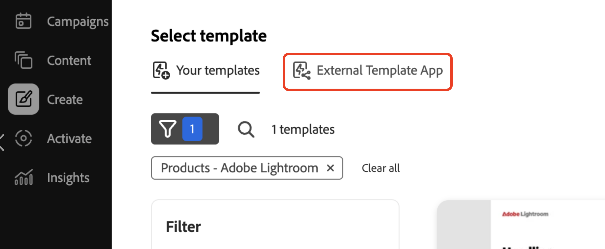

# Distribuire l’app

L’esecuzione dell’app offre un’istantanea preliminare del comportamento del componente aggiuntivo prima della distribuzione. Questo può essere utile per il debug.

## Eseguire l’app

Esegui l&#39;app in `https://localhost:9080`:

```bash
aio app run
```

## Distribuire l’app

1. Passa all’area di lavoro di implementazione:

   ```bash
   aio app use -w [deployment_workspace]
   ```

2. Distribuire l’app:

   ```bash
   aio app deploy
   ```

## Forza ridistribuzione

Puoi forzare la creazione e la distribuzione dell’app senza inviarla nuovamente per l’approvazione.

>[!NOTE]
>
>L’imposizione di una build e di una distribuzione sovrascrive la distribuzione esistente. **Esegui prima il test completo dell&#39;app** in un ambiente di test.

```bash
aio app build --force-build
```

```bash
aio app deploy --force-deploy
```

## Generazione e distribuzione simultanee

```bash
aio app deploy --force-build --force-deploy
```

## Trova la nuova app

Dopo la distribuzione, puoi visualizzare la nuova app in GenStudio for Performance Marketing.

### Visualizza con un URL

Visualizza la nuova app aggiungendo un parametro `query` all&#39;URL di GenStudio for Performance Marketing:

```txt
https://experience.adobe.com/?ext=https://<my-deployed-add-on>.adobeio-static.net/index.html#/@<ims-org>/genstudio/create
```

### Visualizza nell’interfaccia utente

Le nuove estensioni si trovano in posizioni diverse nell&#39;interfaccia utente, a seconda del tipo di estensione distribuito. I punti di estensione attualmente disponibili sono:

* Estensione della conformità, che include:
   * [*punti di estensione prompt*](#find-prompt-extensions), che consentono ai clienti di aggiungere ulteriore contesto alla generazione LLM e
   * [*punti di estensione di convalida*](#find-validation-extensions), che consentono ai clienti di convalidare il contenuto generato da LLM. La convalida viene spesso associata all’estensione Prompt per assicurarsi che il contenuto generato con un prompt esteso sia in conflitto con i requisiti del cliente (ad esempio, dichiarazioni su medicinali o legali)
* [Estensione Digital Asset Management (DAM)](#find-dam-extensions)
* [Estensione modello](#find-template-extensions)
* [Estensione di traduzione](#find-translation-extensions)

### Trova estensioni prompt

Le estensioni dei prompt si trovano nel menu a discesa **Componenti aggiuntivi**, nella **sezione parametri** di un modello.

{width="600" zoomable="yes"}

Viene visualizzata la finestra di dialogo del componente aggiuntivo, che consente di selezionare il contesto aggiuntivo da aggiungere per la generazione LLM.

{width="600" zoomable="yes"}

### Trova estensioni di convalida

Le estensioni di convalida si trovano dopo una generazione di prompt, nel lato destro visualizzato con i risultati.

{width="600" zoomable="yes"}

Esegui l’estensione selezionata per convalidare il contenuto generato.

{width="600" zoomable="yes"}

### Trovare estensioni DAM

Le estensioni Digital Asset Management (DAM) si trovano quando si seleziona il contenuto nella **sezione parametri** di un modello. Per visualizzare eventuali componenti aggiuntivi, vedi la parte inferiore del menu a discesa **Seleziona percorso**.

{width="600" zoomable="yes"}

### Trovare le estensioni dei modelli

Le estensioni del modello si trovano nella scheda **External Template App** quando si seleziona un modello. Questa scheda viene visualizzata solo in presenza di app modello da selezionare.

{width="600" zoomable="yes"}


### Trovare le estensioni di traduzione

Utilizza i punti di estensione della traduzione per portare il tuo servizio di traduzione tramite un proxy invece di utilizzare la traduzione predefinita di GenStudio.
Nessuna posizione dell&#39;interfaccia utente per queste estensioni.

Se l&#39;estensione è registrata, viene utilizzato il servizio di traduzione fornito. In caso contrario, viene utilizzato il servizio di traduzione GenStudio predefinito.


Se si è soddisfatti del componente aggiuntivo, è possibile distribuirlo senza il parametro `query`.

Ora puoi [distribuire la tua app](distribute-app.md).
