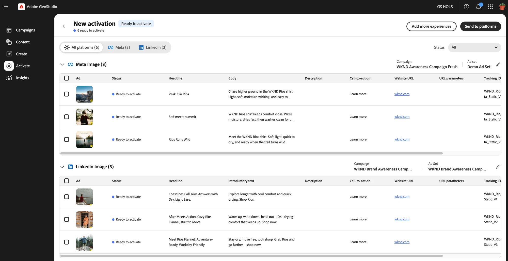

# Flusso di lavoro attivazione

[!DNL Activate] attiva le esperienze pubblicate sui loro canali di annunci a pagamento. Un’esperienza GenStudio for Performance Marketing è un componente della campagna di marketing, ad esempio un annuncio, che viene preparato per un pubblico specifico su un canale di annuncio a pagamento. Le esperienze per l’attivazione contengono tre componenti principali:

* **Risorse multimediali**: immagini o video inclusi nella tua esperienza pubblicitaria. I tipi di file supportati e le proporzioni variano a seconda del canale e del formato.

* **Testo**: tutti i moduli di testo inclusi nell&#39;annuncio, inclusi titoli, corpo del testo ed elementi di call-to-action.

* **Metadati**: attributi definiti dall&#39;utente che migliorano l&#39;analisi, il filtraggio e il tracciamento delle prestazioni. In genere, i metadati non sono visibili al pubblico finale dell’annuncio.

Questi componenti vengono preparati e approvati in [!DNL Content] prima dell&#39;attivazione. [!DNL Activate] non crea né modifica le risorse approvate, i titoli o la copia del corpo. Applica solo la configurazione di cui ogni canale ha bisogno, quindi pubblica l’esperienza.

Una singola tabella di attivazione può includere esperienze per più canali di annunci a pagamento e formati di annunci contemporaneamente.

>[!VIDEO](https://video.tv.adobe.com/v/3503538?learn=on)

## Collegare gli account del canale

Un system manager o editor di GenStudio deve collegare gli account annuncio per ogni canale di annuncio a pagamento prima di poter attivare un’esperienza su tale canale. Per visualizzare i passaggi per questo processo, consulta [Connessione di account multimediali a pagamento](/help/user-guide/connectors/connect-channel.md).

## Avviare un’attivazione

Avvia un&#39;attivazione da uno dei due punti di ingresso:

* **Da[!DNL Content]**: filtra in esperienze, seleziona una o più esperienze pubblicate, quindi fai clic su **[!UICONTROL Attiva]** nella barra delle azioni superiore.
* **Da[!DNL Activate]**: nella pagina di destinazione [!DNL Activate], fare clic su **[!UICONTROL + Nuova attivazione]**. Viene aperta la galleria di esperienze, in cui puoi selezionare le esperienze da attivare.

In entrambi i casi, cerca per nome esperienza o filtra per più canali per trovare le esperienze desiderate.

Se la selezione include esperienze in formato display, specifica la piattaforma di visualizzazione da utilizzare: Google Campaign Manager 360, Innovid, Amazon Ads o The Trade Desk. Quindi fare clic su **[!UICONTROL Avvia attivazione]**. Per altri formati, come Meta, LinkedIn, TikTok, YouTube e ChatGPT, [!DNL Activate] deduce la piattaforma dal canale dell&#39;esperienza e ignora questo passaggio.

[!DNL Activate] genera una tabella di attivazione che elenca tutte le esperienze selezionate. La tabella è organizzata in sottotabelle per formato di annuncio e canale, ad esempio immagine singola di Meta o immagine singola di LinkedIn. Ogni riga rappresenta un annuncio. Per la maggior parte dei canali, come LinkedIn, TikTok e i canali di visualizzazione, un’esperienza con proporzioni multiple genera una riga per proporzione; elimina le righe non necessarie. Meta è l&#39;eccezione. Un annuncio Meta può includere più proporzioni all’interno di un singolo annuncio, pertanto un’esperienza Meta con più proporzioni genera ancora una sola riga.

La tabella di attivazione viene salvata automaticamente come bozza all&#39;apertura. Potete lasciare e riprendere la bozza in qualsiasi momento prima di pubblicarla.

Per aggiungere altre esperienze a una tabella di attivazione già aperta, fai clic su **[!UICONTROL Aggiungi altre esperienze]** in alto a destra nella tabella. Verrà riaperta la raccolta esperienze, in modo da poter selezionare altre esperienze, che [!DNL Activate] aggiunge alla tabella esistente.

**[!UICONTROL Aggiungi più esperienze]** ti consente inoltre di attivare più piattaforme di visualizzazione nella stessa tabella. Le esperienze in formato visualizzazione ti richiedono di scegliere prima una singola piattaforma di visualizzazione, ma puoi fare clic su **[!UICONTROL Aggiungi altre esperienze]**, selezionare più esperienze in formato visualizzazione e scegliere una piattaforma di visualizzazione diversa da quella già presente nella tabella. Ad esempio, puoi aggiungere gli annunci di Trade Desk a una tabella che contiene già annunci Innovid.

## Configurare i dettagli di installazione di annunci e piattaforme

Le risorse approvate, i titoli e la copia del corpo sono bloccati e non possono essere modificati nella tabella di attivazione poiché sono già stati sottoposti a revisione e approvazione in [!DNL Content]. I campi rimanenti possono essere modificati e variano a seconda del canale:

>[!NOTE]
>
>[!DNL Content] chiama una destinazione come Meta o LinkedIn in un **canale**. [!DNL Activate] chiama la stessa destinazione come **piattaforma** (ad esempio, in **[!UICONTROL Configurazione piattaforma]** e nella colonna **Campi di installazione piattaforma modificabili** di seguito). I due termini si riferiscono alla stessa cosa.

Non è necessario cercare in anticipo i campi del canale. [!DNL Activate] mostra solo le colonne relative ai canali e ai formati selezionati. Utilizza la tabella seguente come riferimento per gli elementi modificabili per canale.

**Campi modificabili per canale**

| Canale | Formati supportati | Copia bloccata | Campi di testo modificabili | Campi di configurazione della piattaforma modificabili |
|---|---|---|---|---|
| Meta | Immagine, video, carosello | Titolo, corpo | Descrizione, Call-to-action, URL di destinazione, parametri URL, ID tracciamento | Account annuncio, pagina Facebook, profilo Instagram, campagna Meta, set di annunci Meta |
| LinkedIn | Immagine singola, video singolo | Titolo, testo introduttivo | Descrizione, Call-to-action, URL di destinazione, parametri URL, ID tracciamento | Account dell’annuncio, campagna, set di annunci |
| Google Campaign Manager 360 | Display statico, display video, display Zip HTML5 | n/d | ID tracciamento | Inserzionista |
| Amazon Ads | Visualizzazione statica | n/d | ID tracciamento | Account |
| Innovid | Schermo statico, HTML5 Zip | n/d | ID tracciamento | Account, libreria Creative, nome concetto |
| TikTok | Annunci video in-feed | Testo principale | Call-to-action, URL di destinazione, ID tracciamento | Account dell’annuncio, Campaign, Gruppo di annunci |
| YouTube | Shorts nelle campagne Google Ads Demand Gen | Descrizione | Call-to-action, nome aziendale, URL di destinazione, parametri URL, ID di tracciamento | Account, campagna, gruppo di annunci, logo |
| ChatGPT | Schede chat | Titolo, corpo | URL di destinazione, ID di tracciamento | Account dell’annuncio OpenAI, OpenAI Campaign, gruppo di annunci OpenAI |
| Il Trade Desk | Visualizzazione statica | n/d | ID tracciamento | Account, Campagna |

Un **ID di tracciamento** è un&#39;etichetta univoca assegnata a una riga di annuncio. Viene passato alla piattaforma di destinazione come nome dell’annuncio o della creatività, quindi utilizzalo per identificare l’annuncio a scopo di reporting e risoluzione dei problemi.

Modificare i campi in linea per riga oppure selezionare più righe all&#39;interno della stessa tabella di formato e fare clic su **[!UICONTROL Modifica dettagli]** sulla barra degli strumenti che consente di modificare questi campi in blocco contemporaneamente. Per configurare i campi di installazione della piattaforma per un gruppo di formati di annunci, fai clic su **[!UICONTROL Gestisci impostazioni piattaforma]** e modifica i campi nella finestra di dialogo risultante.

Per spostarsi più rapidamente tra i campi **[!UICONTROL ID di tracciamento]**, utilizzare le seguenti scelte rapide da tastiera:

* Premi **Invio** per aprire il campo di modifica per il **[!UICONTROL ID di tracciamento]** selezionato.
* Premi il tasto freccia **Su** o **Giù** per passare al campo **[!UICONTROL ID di tracciamento]** precedente o successivo nella colonna.
* Premi di nuovo **Invio** per salvare le modifiche.

## Rivedere e pubblicare le esperienze sui loro canali pubblicitari

Verificare che ogni riga mostri [!UICONTROL Pronto per l&#39;attivazione]. [!DNL Activate] flag mancanti o non validi, chiamate all&#39;azione non compatibili e ID di tracciamento duplicati come [!UICONTROL Richiede attenzione]. Quando ogni riga è pronta, fai clic su **[!UICONTROL Invia a Platform]** e conferma nella finestra di dialogo di pubblicazione.

[!DNL Activate] segnala lo stato di ogni annuncio quasi in tempo reale: In sospeso, quindi Pubblicato o Non riuscito. Se un annuncio non riesce, passa il cursore del mouse sul relativo stato per visualizzare l’errore della piattaforma. È possibile riprovare contemporaneamente ogni annuncio non riuscito nella tabella facendo clic su **[!UICONTROL Riprova]**, anziché riprovare singolarmente. Le righe pubblicate non possono essere inviate nuovamente e includono un collegamento profondo all’annuncio nel gestore di annunci nativo della piattaforma di destinazione. La revisione finale pre-pubblicazione e l&#39;avvio degli annunci si verificano nel gestore degli annunci del canale di destinazione: [!DNL Activate] distribuisce sempre gli annunci in uno stato inattivo.

Le tabelle di attivazione vengono visualizzate nella pagina di destinazione [!DNL Activate].

## Canali supportati

Ogni canale di annunci a pagamento dispone di campi di configurazione e prerequisiti specifici per il canale. Seleziona il canale dell’annuncio a pagamento per le linee guida sull’attivazione:

* [Meta](activate-meta-ad.md)
* [LinkedIn](activate-linkedin-ad.md)
* [Gestione campagne Google 360](activate-cm360-ad.md)
* [Amazon Ads](activate-amazon-ad.md)
* [Innovid](activate-innovid-ad.md)
* [TikTok](activate-tiktok-ad.md)
* [YouTube](activate-youtube-ad.md)
* [ChatGPT](activate-chatgpt-ad.md)
* [Il Trade Desk](activate-trade-desk-ad.md)
