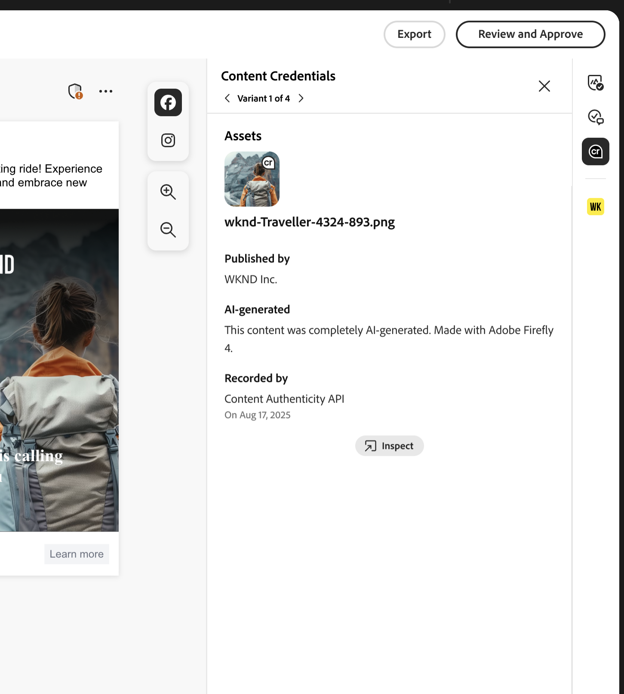

# Content Credentials per le organizzazioni

Scopri come le credenziali a prova di manomissione per i contenuti che dimostrano l’autenticità del brand e promuovono la conformità sono incorporate direttamente nel flusso di lavoro di marketing.

## Introduzione a Content Credentials {#content-credentials}

>[!CONTEXTUALHELP]
>id="gspm_content_credentials"
>title="Content Credentials in [!DNL GenStudio for Performance Marketing]"
>abstract="Le credenziali a prova di manomissione per i contenuti che dimostrano l’autenticità del brand e favoriscono la conformità possono essere incorporate direttamente nel flusso di lavoro di marketing."

GenStudio for Performance Marketing applica Content Credentials a livello globale a tutte le risorse in modo automatico. Non esiste un passaggio di configurazione e un’impostazione per risorsa da attivare: le credenziali vengono incorporate, mantenute e aggiornate in tutto il flusso di lavoro di marketing.

Una volta pubblicato il contenuto, Content Credentials sarà visibile su piattaforme esterne, come LinkedIn.

I Content Credentials compatibili con C2PA non richiedono alcuna configurazione di certificati. La firma del marchio rappresenta un’eccezione: per firmare i contenuti con la firma della tua organizzazione, un amministratore deve caricare un certificato X.509 valido all’interno di Admin Console. Questo passaggio garantisce che la firma digitale dell&#39;azienda sia configurata correttamente e pronta per essere utilizzata nelle applicazioni Adobe DX supportate.

## Cosa sono i Content Credentials? 

Content Credentials è un tipo di metadati resistente e conforme agli standard di settore con dettagli su come sono stati creati i contenuti e informazioni sull’identità dei creatori. Content Credentials può essere visualizzato quando il contenuto viene pubblicato online su piattaforme di supporto oppure utilizzando strumenti come [Ispect tool di Adobe](https://contentauthenticity.adobe.com/inspect) o l&#39;estensione del browser [Adobe Content Authenticity Chrome](https://helpx.adobe.com/it/creative-cloud/help/cai/adobe-content-authenticity-chrome-browser-extension.html).  

L’applicazione di Content Credentials può contribuire ad aumentare la trasparenza sulle modalità di creazione dei contenuti e può aiutare gli utenti a connettersi ai propri contenuti.

[Ulteriori informazioni su Content Credentials](https://helpx.adobe.com/it/creative-cloud/help/content-credentials.html) in Adobe.

## Firma del marchio e tracciamento delle risorse

I contenuti firmati con il brand svolgono un ruolo significativo nel promuovere l’integrità del brand e la fiducia degli utenti. Le organizzazioni possono firmare i propri contenuti con una firma univoca del marchio nelle applicazioni Adobe quando il certificato è configurato correttamente in Admin Console. Questa garanzia di autenticità viene mantenuta utilizzando tecnologie invisibili di filigrana e impronte digitali, che contribuiscono a preservare la durata della firma per tutto il ciclo di vita del contenuto.

Oltre alla firma del marchio, le aziende possono allegare gli ID delle risorse direttamente ai propri contenuti. Questo facilita il tracciamento efficiente delle risorse, in particolare quando sono condivise o pubblicate su piattaforme di social media. Incorporando gli ID delle risorse, le organizzazioni possono tracciare l’origine e il percorso di distribuzione dei loro contenuti, migliorando la supervisione e la responsabilità.

## Content Credentials nel flusso di lavoro marketing

L’applicazione di Content Credentials può essere eseguita direttamente in GenStudio for Performance Marketing nell’intero flusso di lavoro di marketing, dall’importazione e dall’individuazione dei contenuti all’attivazione e all’esportazione. Troverai anche le credenziali visualizzate sul contenuto per la revisione in tutta l&#39;app.

### Importazione e rilevamento

Nella raccolta Contenuto, le credenziali vengono visualizzate sulle risorse importate.

Il badge Content Credential nell&#39;angolo superiore destro della miniatura indica il contenuto [!UICONTROL Firmato da marchio].

Quando si seleziona un contenuto firmato vengono visualizzati i metadati dettagliati: marchio pubblicato, registratore, strumento utilizzato, marca temporale.

Il contenuto può essere filtrato in base allo stato delle credenziali.

### Creazione e selezione

I badge di Content Credential sono visualizzati nel selettore delle risorse Canvas.

I metadati delle credenziali vengono conservati, poiché le risorse vengono selezionate per le esperienze al fine di mantenere la catena di provenienza durante la modifica.

### Modifica e trasformazione

Durante le esportazioni da una bozza, le risorse modificate vengono automaticamente rifirmate e le nuove credenziali vengono collegate all’originale.

{width="60%"}

### Revisione e approvazione

Nell’anteprima Rivedi e approva, viene visualizzato lo stato delle credenziali per le risorse nella barra a destra.

{width="60%"}

I dettagli delle credenziali per variante vengono visualizzati quando i revisori ispezionano le risorse. Le esperienze approvate vengono rifirmate quando gli utenti fanno clic su **[!UICONTROL Salva nel contenuto]**.

### Attivazione ed esportazione

Durante l’attivazione, lo stato delle credenziali viene visualizzato nel selettore Esperienza.

{width="60%"}

I file esportati avranno credenziali compatibili con C2PA incorporate.

Anche le risorse esportate mantengono la propria derivazione. Le credenziali incorporate registrano le risorse da cui è stata derivata l’esportazione, in modo che sia possibile risalire all’esperienza esportata attraverso le modifiche apportate alla risorsa importata originale. Poiché la derivazione si sposta all’interno del file, rimane ispezionabile dopo che la risorsa lascia GenStudio for Performance Marketing.

L&#39;integrità delle credenziali viene mantenuta in tutti i formati supportati (JPEG, PNG, MP4).

## Informazioni correlate

* [Trasparenza dei contenuti](https://experienceleague.adobe.com/it/docs/cx-enterprise-ai/experience-cloud-ai/overview/content-transparency)
* [Content Credentials](https://helpx.adobe.com/it/creative-cloud/help/content-credentials.html) in Adobe
