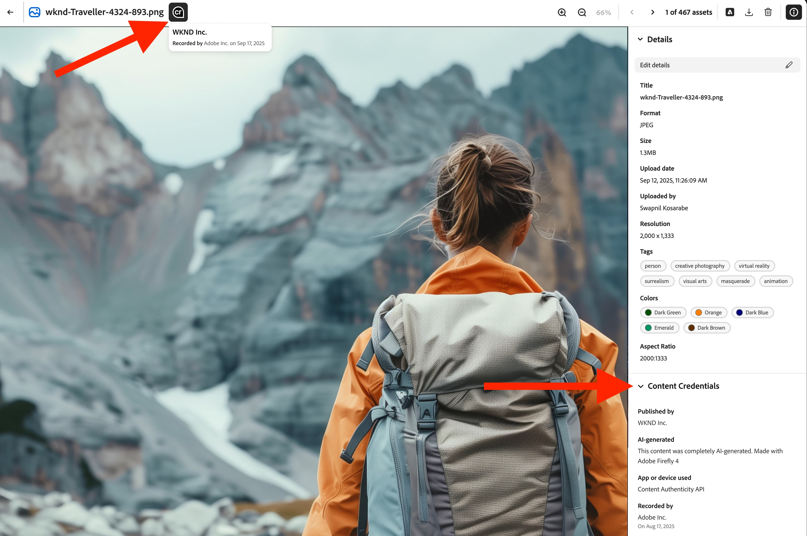
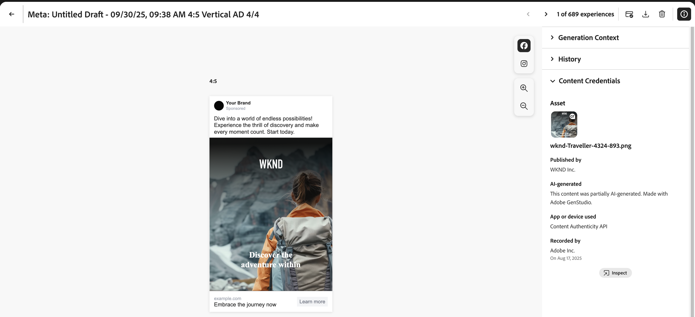

# Content Credentials per le organizzazioni

Scopri come le credenziali a prova di manomissione per i contenuti che dimostrano l’autenticità del brand e promuovono la conformità sono incorporate direttamente nel flusso di lavoro di marketing.

>[!WARNING]
>
> Questa funzione è attualmente in versione beta ed è disponibile solo per le organizzazioni a cui è stato concesso l’accesso. Se ti interessa, contatta il rappresentante del team del tuo account Adobe o [utilizza questo collegamento per richiedere l&#39;iscrizione](https://www.feedbackprogram.adobe.com/c/a/5aWPEOthrDv22Mf9CyekOy?source=qr).

## Introduzione a Content Credentials

Dopo l’attivazione di Content Credentials in Admin Console, gli utenti di GenStudio for Performance Marketing possono attivare Content Credentials per tutte le risorse a livello globale nell’app. Se l’opzione globale per l’applicazione delle credenziali è disattivata, gli utenti possono scegliere di applicare Content Credentials a ogni singola risorsa.

Una volta pubblicato il contenuto, Content Credentials sarà visibile su piattaforme esterne, come LinkedIn.

Gli amministratori sono responsabili del caricamento di un certificato X.509 valido all’interno di Admin Console. Questo passaggio garantisce che la firma digitale dell&#39;azienda sia configurata correttamente e pronta per essere utilizzata nelle applicazioni Adobe DX supportate.

>[!NOTE]
>
>Il controllo su questa impostazione potrebbe in futuro passare ad Admin Console, semplificando la gestione di Content Credentials tra le applicazioni e migliorando la supervisione amministrativa.

## Cosa sono i Content Credentials? 

Content Credentials è un tipo di metadati resistente e conforme agli standard di settore con dettagli su come sono stati creati i contenuti e informazioni sull’identità dei creatori. Content Credentials può essere visualizzato quando il contenuto viene pubblicato online su piattaforme di supporto oppure utilizzando strumenti come [Ispect tool di Adobe](https://contentauthenticity.adobe.com/inspect) o l&#39;estensione del browser [Adobe Content Authenticity Chrome](https://helpx.adobe.com/it/creative-cloud/help/cai/adobe-content-authenticity-chrome-browser-extension.html).  

L’applicazione di Content Credentials può contribuire ad aumentare la trasparenza sulle modalità di creazione dei contenuti e può aiutare gli utenti a connettersi ai propri contenuti.

[Ulteriori informazioni su Content Credentials](https://helpx.adobe.com/it/creative-cloud/help/content-credentials.html) in Adobe.

## Firma del marchio e tracciamento delle risorse

I contenuti firmati con il brand svolgono un ruolo significativo nel promuovere l’integrità del brand e la fiducia degli utenti. Le organizzazioni possono firmare i propri contenuti con una firma univoca del marchio nelle applicazioni Adobe quando il certificato è configurato correttamente in Admin Console. Questa garanzia di autenticità viene mantenuta utilizzando tecnologie invisibili di filigrana e impronte digitali, che contribuiscono a preservare la durata della firma per tutto il ciclo di vita del contenuto.

Oltre alla firma del marchio, le aziende possono allegare gli ID delle risorse direttamente ai propri contenuti. Questo facilita il tracciamento efficiente delle risorse, in particolare quando sono condivise o pubblicate su piattaforme di social media. Incorporando gli ID delle risorse, le organizzazioni possono tracciare l’origine e il percorso di distribuzione dei loro contenuti, migliorando la supervisione e la responsabilità.

## Content Credentials nel flusso di lavoro marketing

L’applicazione di Content Credentials può essere eseguita direttamente in GenStudio for Performance Marketing nell’intero flusso di lavoro di marketing, dall’importazione e dall’individuazione dei contenuti all’attivazione e all’esportazione. Troverai anche le credenziali visualizzate sul contenuto per la revisione in tutta l&#39;app.

### Importazione e rilevamento

Nella raccolta Contenuto, le credenziali vengono visualizzate sulle risorse importate.

Il badge Content Credential nell’angolo superiore destro della miniatura indica il contenuto con firma del marchio.

Quando si seleziona un contenuto firmato vengono visualizzati i metadati dettagliati: marchio pubblicato, registratore, strumento utilizzato, marca temporale.

Il contenuto può essere filtrato in base allo stato delle credenziali.

### Creazione e selezione

I badge di Content Credential sono visualizzati nel selettore delle risorse Canvas.

I metadati delle credenziali vengono conservati, poiché le risorse vengono selezionate per le esperienze al fine di mantenere la catena di provenienza durante la modifica.

### Modifica e trasformazione

Durante le esportazioni da una bozza, le risorse modificate vengono automaticamente rifirmate e le nuove credenziali vengono collegate all’originale.

{width="60%"}

### Revisione e approvazione

Nell’anteprima Rivedi e approva, viene visualizzato lo stato delle credenziali per le risorse nella barra a destra.

{width="60%"}

I dettagli delle credenziali per variante vengono visualizzati quando i revisori ispezionano le risorse. Le esperienze approvate vengono rifirmate quando gli utenti fanno clic su **[!UICONTROL Salva nel contenuto]**.

### Attivazione ed esportazione

Durante l’attivazione, lo stato delle credenziali viene visualizzato nel selettore Esperienza.

{width="60%"}

I file esportati avranno credenziali compatibili con C2PA incorporate.

L&#39;integrità delle credenziali viene mantenuta in tutti i formati supportati (JPEG, PNG, MP4).

