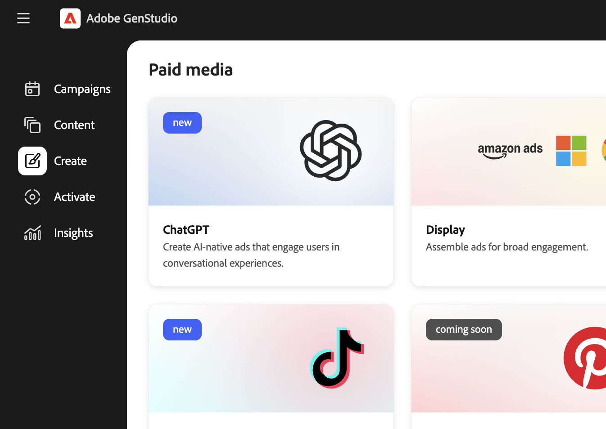

# Creare un’esperienza di annuncio ChatGPT

Utilizza [[!DNL Create]](/help/user-guide/create/overview.md) in [!DNL GenStudio for Performance Marketing] per creare **annunci ChatGPT** come esperienze multimediali a pagamento, dalle linee guida e risorse fino alla generazione, ai controlli del brand e dei canali, all&#39;approvazione, alla pubblicazione in [!DNL Content] e all&#39;attivazione nello stesso flusso [!DNL Activate] utilizzato per canali come Meta e Google Campaign Manager 360.

Prima di iniziare, [aggiungi le linee guida](/help/user-guide/guidelines/add-guidelines.md) dove necessario e controlla [i prompt validi](/help/user-guide/effective-prompts.md) in modo che i prompt dei titoli producano varianti valide.

## Prerequisiti

Prima di creare o attivare annunci ChatGPT in [!DNL GenStudio for Performance Marketing], è necessario configurarli in base a questi prerequisiti.

### Accesso e ruoli

* Hai un ruolo **Editor** o superiore in [!DNL GenStudio for Performance Marketing]. Consulta [Ruoli utente e autorizzazioni](/help/user-guide/user-roles.md).
* Hai un **account annuncio OpenAI** e una **chiave API** da tale account.
* Un account **ChatGPT Ads** è connesso a [!DNL GenStudio for Performance Marketing].

Per creare una chiave API in OpenAI Ads Manager:

1. In OpenAI Ads Manager, vai a **[!UICONTROL Impostazioni]** > **[!UICONTROL Chiavi API]** > **[!UICONTROL Crea nuova chiave]**.

Per connettere l&#39;account ChatGPT Ads in [!DNL GenStudio for Performance Marketing]:

1. Nell&#39;area in basso a sinistra, fare clic su **[!UICONTROL Altro]** > **[!UICONTROL Impostazioni]** > **[!UICONTROL ChatGPT]** > **[!UICONTROL Connetti]** > **[!UICONTROL Aggiungi account]**.
1. Immetti il nome dell&#39;account OpenAI Ad, incolla la chiave API e fai clic su **[!UICONTROL Aggiungi account]**.

L’account dell’annuncio è connesso al completamento del flusso.

### Crea configurazione

* **[!DNL Brands]**, **[!DNL Products]** e **[!DNL Personas]** sono configurati in modo che l&#39;app possa generare una copia sul marchio. Consulta [Panoramica delle linee guida](/help/user-guide/guidelines/overview.md).
* Le immagini che si desidera utilizzare sono disponibili in [[!DNL Content]](/help/user-guide/content/overview.md).

## Generare un annuncio ChatGPT

Gli annunci ChatGPT vengono creati come esperienze multimediali a pagamento nell&#39;area di lavoro [!DNL Create].

### Avviare un’esperienza ChatGPT

Per aprire la creazione di ChatGPT:

1. Vai a **[!UICONTROL Crea]** > **[!UICONTROL ChatGPT]**. Non selezioni i modelli per ChatGPT; viene utilizzato un singolo layout di annuncio.
   {width="60%"}
1. Nell&#39;_Area di lavoro_, effettuare le selezioni per **[!DNL Brand]**, **[!DNL Product]**, **[!DNL Persona]** e **Lingua**.
1. Selezionare un&#39;immagine da [!DNL Content].
1. Immetti un prompt per la copia del titolo ChatGPT.
1. Fai clic su **[!UICONTROL Genera]**.

[!DNL GenStudio for Performance Marketing] **genera quattro** varianti creative.

Puoi eseguire le seguenti operazioni:

* Utilizza **[!UICONTROL Rigenera]** o **[!UICONTROL Perfeziona]** per regolare il tono, la lunghezza o l&#39;enfasi.
* Modifica il testo direttamente nell&#39;_Area di lavoro_.
* Utilizza **[!UICONTROL Scambia]** per scegliere un&#39;immagine alternativa da [!DNL Content].

Consulta [Gestione varianti](/help/user-guide/create/manage-variants.md) per ulteriori modi per modificare le esperienze generate.

### Eseguire controlli del marchio e dei canali

Prima di salvare o inviare l’esperienza per la revisione, convalida la copia e il layout in base alle regole del marchio e del canale.

Per eseguire i controlli del contenuto:

1. Fai clic su **[!UICONTROL Verifica contenuto]** (controlli marchio e canale).
1. Verifica i risultati della convalida nel [_pannello Controllo contenuto_](/help/user-guide/guidelines/brand-validation.md#content-check-panel).
1. Risolvere i problemi segnalati, ad esempio la lunghezza della copia o il testo su schermo denso, modificando le varianti o rigenerando in base alle esigenze.

Consulta [Convalida marchio](/help/user-guide/guidelines/brand-validation.md).

## Salva un annuncio ChatGPT in [!DNL GenStudio for Performance Marketing]

Il salvataggio sposta l&#39;esperienza dell&#39;annuncio ChatGPT in [!DNL Content] in modo che possa essere rivista, riutilizzata e attivata.

Sono disponibili due stati:

* **Bozza di esperienza** — Lavoro in corso e non approvato.
* **Esperienza pubblicata** — approvata e disponibile in [!DNL Content] per l&#39;attivazione.

### Invia per revisione

1. Nell&#39;intestazione dell&#39;esperienza, fare clic su **[!UICONTROL Richiedi revisione]**.
1. Seleziona gli approvatori (ad esempio le parti interessate a livello di marchio, legale o prestazioni).
1. Facoltativo: aggiungere una nota in **[!UICONTROL Impostazioni]**.
1. Fai clic su **[!UICONTROL Invia per revisione]**.

Gli approvatori possono visualizzare l&#39;esperienza ChatGPT, i risultati del controllo del brand e del canale e **[!UICONTROL Approvare]** o richiedere modifiche.

Vedi [Richiedi revisione e approvazione](/help/user-guide/approvals/request-review.md) e [Revisioni e approvazioni](/help/user-guide/approvals/overview.md).

### Pubblica nel contenuto

Dopo tutte le approvazioni richieste, pubblica in [!DNL Content]:

1. Fare clic su **[!UICONTROL Pubblica nel contenuto]**.
1. Conferma i metadati, ad esempio il nome della campagna o dell&#39;attivazione, l&#39;area geografica, la lingua, l&#39;utente tipo, la fase funnel e **il canale: ChatGPT**.
1. Fai clic su **[!UICONTROL Pubblica]**.

L&#39;annuncio ChatGPT viene visualizzato in [!DNL Content], individuabile con filtri quali canale o campagna, ed è pronto per la selezione in [!DNL Activate].

Consulta [Pubblicare contenuti approvati](/help/user-guide/approvals/publish-content.md) e [[!DNL Content] panoramica](/help/user-guide/content/overview.md).

## Attivare un annuncio ChatGPT

L&#39;attivazione di ChatGPT utilizza lo stesso modulo [[!DNL Activate]](/help/user-guide/activation/overview.md) di Meta e Google Campaign Manager 360. Consulta [Creare un&#39;attivazione](/help/user-guide/activation/create-activation.md) per il flusso di lavoro di attivazione condivisa.

### Avvia attivazione ChatGPT

È possibile iniziare da [!DNL Content] o da [!DNL Activate].

**Da[!DNL Content]**

* Seleziona una o più esperienze **pubblicate** ChatGPT.

**Da[!DNL Activate]**

* Apri la scheda **ChatGPT** e fai clic su **[!UICONTROL + Nuovo]**.

Ogni esperienza è associata a **un** annuncio ChatGPT.

### Configurare la configurazione dell’esperienza

Per ogni esperienza selezionata, conferma:

* **Titolo**
* **Corpo**
* **URL di destinazione** — Deve utilizzare un formato `https://` valido (ad esempio `https://www.example.com`).

### Configurare la configurazione della piattaforma

Seleziona i dettagli di ChatGPT Ads Manager:

* **Account OpenAI Ads**
* **Campagna ChatGPT** — Deve esistere già in OpenAI Ads Manager.
* **Gruppo di annunci ChatGPT** — Deve esistere già in OpenAI Ads Manager.
* **Nome annuncio ChatGPT** — Un nome distinto per annuncio ChatGPT.

### Revisione e pubblicazione

1. Rivedi tutti i dettagli relativi alla creatività e alla piattaforma.
1. Fai clic su **[!UICONTROL Pubblica]**.

[!DNL GenStudio for Performance Marketing] invia gli annunci a ChatGPT Ads Manager in uno stato **inattivo** in modo che il team multimediale controlli la tempistica e il budget del lancio finale, in modo coerente con gli altri canali a pagamento. Consulta [Attiva panoramica](/help/user-guide/activation/overview.md).

### Cosa succede dopo la pubblicazione

* Viene visualizzata una finestra modale di **pubblicazione in corso** che si chiude automaticamente.
* Sei stato reindirizzato alla tabella **Attivazione ChatGPT**, in cui sono elencate le attivazioni più recenti. Lo stato mostra **[!UICONTROL In sospeso]** al completamento dell&#39;elaborazione.
* Puoi spostarti mentre termina la pubblicazione.

Al termine dell’elaborazione:

* Un pop-up di conferma mostra **success** o **failure**.
* Se fai clic sul pop-up o apri l&#39;attivazione ChatGPT nella tabella di attivazione, viene visualizzata la pagina **Dettagli**.
* Se l&#39;attivazione **[!UICONTROL non è riuscita]**, nella tabella viene visualizzato lo stato e un messaggio di errore di ChatGPT.

In OpenAI Ads Manager, i team dei media possono eseguire controlli finali e attivare annunci o gruppi di annunci quando sono pronti.
