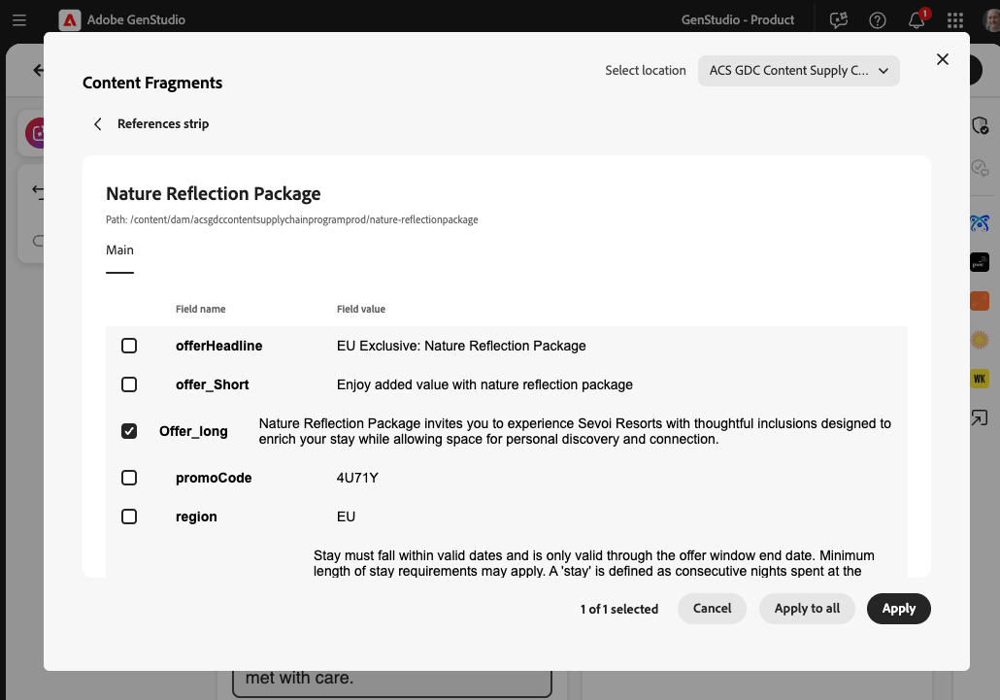

# Esperienze e-mail

Con Adobe GenStudio for Performance Marketing, puoi utilizzare l&#39;intelligenza artificiale generativa per semplificare la [creazione di esperienze e-mail ad alto impatto](/help/user-guide/create/create-email-experience.md).

[!DNL Create] consente ai moderni esperti di marketing di utilizzare [linee guida](/help/user-guide/guidelines/overview.md), risorse immagine e un [prompt ben creato](/help/user-guide/effective-prompts.md) per [creare rapidamente esperienze e-mail allineate al brand](/help/user-guide/create/create-email-experience.md).

Durante la generazione delle esperienze e-mail, vengono create e visualizzate quattro varianti nell’area di lavoro.

Le sezioni modificabili di un’esperienza e-mail includono:

* Pre-intestazione
* Titolo
* Sottotitolo
* Corpo
* Call to action (CTA)
* Immagine

Vedi [Elementi modello](/help/user-guide/templates/use-templates.md#template-elements).

<!-- 
## Email capabilities

Content creators and marketers can produce brand-consistent email experiences in GenStudio for Performance Marketing. 
-->

## E-mail con più sezioni

Le esperienze e-mail possono essere suddivise in più sezioni per consentire la personalizzazione completa in base al marchio e agli obiettivi. [Seleziona [!DNL Products] e risorse visive per ogni sezione](/help/user-guide/create/create-email-experience.md#add-parameters) e utilizza [prompt strutturati](/help/user-guide/effective-prompts.md#structured-prompts) per creare contenuto univoco. Ogni sezione supporta una risorsa visiva.

Consulta [personalizzazione dei modelli con sezioni](/help/user-guide/templates/customize-template.md#sections-or-groups) per scoprire come creare un modello con più sezioni.

## Caricamento progressivo

All’avvio del processo di generazione dei contenuti, ogni sezione di contenuto generato nelle varianti e-mail viene caricata progressivamente nell’area di lavoro. Le esperienze, le risorse e i campi e le sezioni all’interno delle esperienze, vengono visualizzati singolarmente nell’Area di lavoro quando vengono generati.

Quando fai clic su **[!UICONTROL Genera]**, nella parte inferiore dell&#39;area di lavoro viene visualizzato un indicatore di caricamento che ti aggiorna sull&#39;avanzamento della generazione.

Ogni campo e sezione di esperienze e-mail viene caricato progressivamente in questa sequenza:

1. Nomi varianti
1. Righe oggetto per tutte le varianti
1. Pre-intestazioni
1. Titoli, corpo dell’e-mail (per e-mail a sezione singola) e inviti all’azione
1. Corpo dell’e-mail per le sezioni successive (per e-mail con più sezioni)
1. Convalida del brand

   Il processo di convalida del marchio e di controllo del contenuto si verifica e il riepilogo del [_controllo del contenuto_](/help/user-guide/guidelines/brand-validation.md#content-check-summary) viene compilato per ogni variante.

## Conteggi caratteri

Dopo aver generato un set di varianti e-mail, puoi visualizzare il conteggio dei caratteri per ogni sezione. Passa il puntatore del mouse o fai clic su una sezione generata, ad esempio l’oggetto o il corpo, quindi vedi il nome della sezione e il numero di caratteri per tale sezione.

{width="500" zoomable="yes"}

## Scambio frammento di contenuto {#content-fragment-swap}

>[!NOTE]
>
>Lo scambio di frammenti di contenuto è attualmente disponibile per **e-mail** esperienze nell&#39;area di lavoro. Il supporto per il canale **Horizon** sarà presto disponibile.

Il contenuto delle e-mail aziendali richiede spesso sia la copia appena generata che i blocchi modulari approvati (come disclaimer, linguaggio di sicurezza, offerte e attestazioni regolamentate) insieme al contenuto che si forma per i modelli. I team che archiviano contenuti modulari in [!DNL Adobe Experience Manager] possono trovare e scambiare tali contenuti da utilizzare nelle esperienze e-mail senza uscire da [!DNL GenStudio for Performance Marketing]. Questa funzione può essere utile per:

* **Contenuto conforme:** IA può riempire gli slot creativi mentre i frammenti approvati per conformità sostituiscono gli slot iniettabili; le aree legali bloccate rimangono invariate durante l&#39;esportazione.
* **Componenti di contenuto riutilizzabili approvati:** I titoli approvati, le esclusioni di responsabilità regionali o le descrizioni dei prodotti possono rimanere nel sistema di record in [!DNL Adobe Experience Manager] mentre gli autori li richiamano in varianti senza soluzioni alternative di copia e incolla.

I creatori assemblano le esperienze nell&#39;area di lavoro; i team di conformità e marchio mantengono i flussi di lavoro di approvazione in [!DNL Adobe Experience Manager]; i team IT e di integrazione collegano archivi e autorizzazioni richieste dalla tua organizzazione.

{width="500" zoomable="yes"}

Quando l’organizzazione abilita lo scambio di frammenti di contenuto, è possibile prevedere:

* I campi dei frammenti di contenuto possono essere compilati da una libreria di contenuti connessa, non solo tramite la digitazione manuale o la sola generazione di IA.
* Sfoglia, cerca e filtra i frammenti utilizzando metadati quali campagna, persona, canale, lingua e marchio.
* Un selettore dell’archivio è disponibile quando sono configurati più archivi.
* Visualizza l’anteprima di un frammento prima che sostituisca il testo del campo.
* Propagazione di una selezione di frammenti su tutte le varianti in un’unica azione.

{width="500" zoomable="yes"}

La tua organizzazione sceglie le origini e gli archivi dei frammenti di contenuto disponibili. Per informazioni sulla configurazione delle origini da parte degli amministratori e sul modo in cui gli autori scambiano la copia dall&#39;area di lavoro con **[!UICONTROL Scambia]**, consulta [Trova estensione frammento di contenuto](/help/extensibility/deploy-app.md#find-content-fragment-extension).
