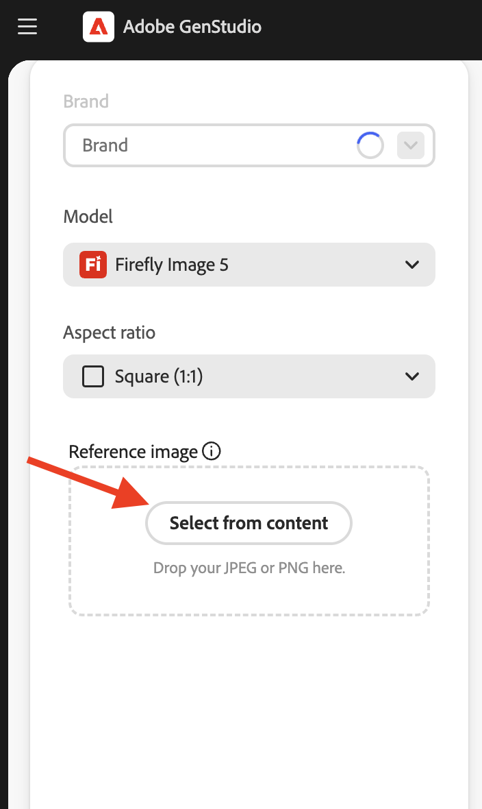

# Genera varianti immagine

Utilizzando GenStudio for Performance Marketing [[!DNL Create]](/help/user-guide/create/overview.md) (icona del pennello), è possibile generare _[!DNL Image variants]_&#x200B;risorse generate che traggono ispirazione da un&#39;immagine scelta, acquisendone l&#39;impatto visivo e l&#39;estetica complessiva.<!-- [two types of images](#image-types) using GenStudio for Performance Marketing [[!DNL Create]](/help/user-guide/create/overview.md) (paintbrush icon)—_[!DNL Image variants]_ and _[!DNL Similar images]_. -->

Per progettare un&#39;immagine accattivante ed efficace, si consiglia di [aggiungere linee guida a GenStudio for Performance Marketing](/help/user-guide/guidelines/add-guidelines.md) e rivedere le [nozioni di base sulla scrittura dei prompt](/help/user-guide/effective-prompts.md).

## Tipi di immagini

_[!DNL Image variants]_&#x200B;sono risorse generate che traggono ispirazione da un&#39;immagine scelta, catturandone l&#39;impatto visivo e l&#39;estetica complessiva. Queste immagini vengono create utilizzando le immagini già disponibili in [!DNL Content] e un prompt creato con cura che ne guida la progettazione. Seguono rigorosamente sia le linee guida del marchio che i parametri scelti durante il processo di generazione.

_[!DNL Image variants]_<!-- and _[!DNL Similar images]_ --> incorpora linee guida per set, parametri e un [prompt creato con cura](/help/user-guide/effective-prompts.md) per fornire risorse di immagine accattivanti.

<!-- * _[!DNL Similar images]_—Image assets created with strong similarity to an existing selected image available in [!DNL Content]. When generating similar images, GenStudio for Performance Marketing redesigns the selected image, giving slight variations on the content to provide variety and nuance. -->

## Genera varianti immagine

Puoi generare [!DNL Image variants] utilizzando linee guida, parametri e un&#39;immagine di riferimento selezionati. Questi elementi, insieme alla richiesta, guidano la generazione di [!DNL Image variants] coerenti.

### Scegli un&#39;immagine di riferimento

Per creare _[!DNL Image variants]_, selezionare un&#39;immagine esistente salvata in [!DNL Content]. Consulta [Best practice per i modelli](/help/user-guide/templates/best-practices-for-templates.md#follow-channel-specific-template-guidelines) per informazioni sulle dimensioni immagine supportate.

**Per scegliere un&#39;immagine di riferimento**:

1. In _[!DNL Create]_, fai clic su **[!UICONTROL Genera varianti immagine]**.
   {width="400" zoomable="yes"}
1. Per scegliere un&#39;immagine di riferimento, utilizzare il pulsante _[!UICONTROL Seleziona dal contenuto]_ per trovare un&#39;immagine specifica.
   {width="200" zoomable="yes"}

   Per utilizzare le risorse di un repository [!DNL AEM Assets Content Hub] connesso, scegliere un repository dal menu a discesa _Posizione_. Filtra e seleziona un’immagine.

   {width="400" zoomable="yes"}

1. Nella visualizzazione _Seleziona immagine_, fai clic su un&#39;immagine per selezionare la casella di selezione.

   Le dimensioni dell&#39;immagine selezionata non possono superare i 10 MB. È possibile selezionare una sola immagine alla volta.

1. Fai clic su **[!UICONTROL Usa]**.

   Viene visualizzato Canvas, che funge da hub centrale per la creazione dei contenuti.

### Aggiungi parametri

L&#39;incorporazione di [linee guida](/help/user-guide/guidelines/overview.md) e parametri migliora il processo di generazione dei contenuti ed è un passaggio preparatorio fondamentale per la produzione di [!DNL Image variants].

**Per aggiungere linee guida e parametri**:

1. Nella scheda _Base_, seleziona un [!DNL Brand] per informare la creazione dei contenuti.

   Se non sono disponibili marchi da questo menu, [aggiungi le linee guida al tuo GenStudio for Performance Marketing](/help/user-guide/guidelines/add-guidelines.md).
1. Selezionare un modello da utilizzare per la generazione di immagini da _[!UICONTROL Modello]_.
1. Selezionare le proporzioni desiderate tra _[!UICONTROL Proporzioni]_.

### Immetti un prompt

Dopo aver selezionato i parametri, crea un prompt utilizzando il linguaggio naturale per iniziare a generare le varianti di immagine.

Vedere [Scrivi prompt effettivi](/help/user-guide/effective-prompts.md).

**Per immettere una richiesta**:

1. Immettete un prompt nella casella prompt.
1. Fai clic su **[!UICONTROL Genera]**.

Per impostazione predefinita, quattro varianti (alimentate dal prompt, dai parametri e dal contenuto aggiunto) vengono generate e visualizzate nell’area di lavoro.

### Modifica in Adobe Express

Dopo aver generato le varianti di immagine, puoi modificarle direttamente in Adobe GenStudio for Performance Marketing utilizzando Adobe Express.

**Per modificare una singola immagine con Adobe Express**:

1. Passa il puntatore del mouse su una variante di immagine generata e fai clic su _[!UICONTROL Modifica in Adobe Express]_.

   Viene visualizzata una finestra _con tecnologia Adobe Express_.

1. Eseguire la modifica dell&#39;immagine, ad esempio [ritagliare un&#39;immagine](https://helpx.adobe.com/it/express/create-and-edit-images/edit-images/crop-images.html), [rimuovere un oggetto](https://helpx.adobe.com/it/express/create-and-edit-images/create-and-modify-with-generative-ai/remove-objects-generative-fill.html) e applicare effetti.

   Consulta la [documentazione di Adobe Express](https://helpx.adobe.com/it/express/user-guide.html) per scoprire come rivedere le immagini in GenStudio for Performance Marketing con Adobe Express.

1. Fai clic su _[!UICONTROL Applica modifiche]_ per salvare le modifiche.
1. Continua a modificare le singole varianti di immagine come desiderato e applica le modifiche per salvare l’avanzamento.

### Verifica l’allineamento della verifica del contenuto

Per ottimizzare le varianti generate e garantire una rigorosa aderenza all&#39;identità del brand, alle linee guida della piattaforma e agli standard di accessibilità, sfrutta la potenza del pannello [_Verifica contenuto_](/help/user-guide/guidelines/brand-validation.md#content-check-panel). Questo pannello mostra i dettagli completi del controllo dei contenuti e illumina le aree del miglioramento.

**Per eseguire i controlli del contenuto**:

1. Fai clic sull&#39;icona del pannello _Verifica contenuto_ nella barra delle azioni a destra per aprire il pannello [_Verifica contenuto_](/help/user-guide/guidelines/brand-validation.md#content-check-panel). Visualizza un riepilogo delle *verifiche necessarie* e *verifiche superate* per vedere quali sezioni e linee guida necessitano di miglioramenti.

   {width="500" zoomable="yes"}

1. Rivedi le varianti di immagine per garantire che siano strettamente allineate con i controlli del contenuto eseguiti.

Consulta [Convalida marchio](/help/user-guide/guidelines/brand-validation.md).

<!-- 
## Generate Similar images

You can quickly generate images similar to a selected image within [!DNL Content] from the [!DNL Create] home.

**To create _[!DNL Similar images]_**:

1. In _[!DNL Create]_, click **[!UICONTROL Similar images]**.
1. Use the search option, adjacent to _Filter_, to find a specific image.

   To use assets from a connected [!DNL AEM Assets Content Hub] repository, choose a repository from the _Location_ drop-down menu. Filter and select one image.

1. In the _Select image_ view, click on an image.
1. Click **[!UICONTROL Use]**.

   The Canvas, which serves as the central hub for content creation, is displayed. Four image variations similar to the original selected image appear.

   {width="400" zoomable="yes"} 
-->

## Pubblicare ed esportare immagini

Le bozze di immagini generate vengono visualizzate nella sezione _Recenti_ della home [!DNL Create].

Per rendere le immagini generate disponibili per l&#39;uso corrente e futuro, pubblicarle in [!UICONTROL Contenuto] ed esportarle per utilizzarle nelle campagne di marketing.

1. **Per pubblicare le nuove immagini**, fai clic su **[!UICONTROL Pubblica]** nella barra degli strumenti superiore.
   1. _[!UICONTROL Aggiungi dettagli]_, ad esempio _[!UICONTROL Campagne]_ o _[!UICONTROL Canali]_, se necessario.
   1. Fai clic su **[!UICONTROL Pubblica]**.

1. **Per esportare le nuove immagini**, fai clic su **[!UICONTROL Esporta]** nella barra degli strumenti superiore.
   1. Seleziona il formato (JPG o PNG) e fai clic su **[!UICONTROL Esporta]**.

Vedere [[!DNL Content]](/help/user-guide/content/overview.md#search-and-find-approved-content).
