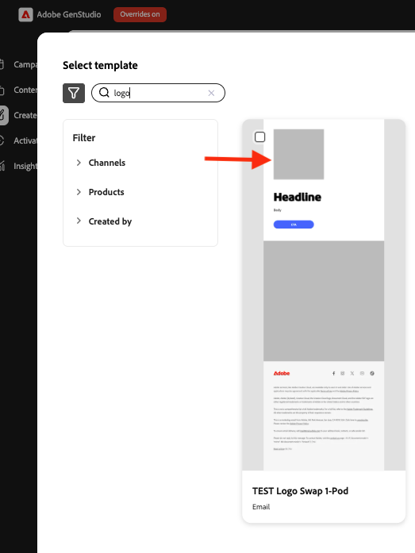
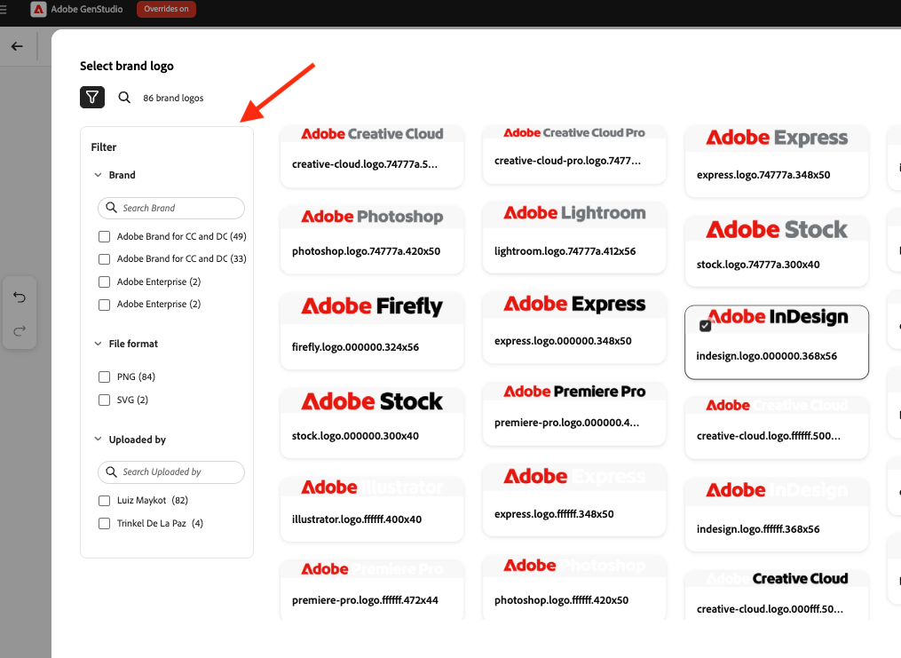

# Usa scambio logo in [!DNL Create]

Utilizzare lo scambio di logo per sostituire i logo dei marchi nei modelli durante la creazione dei contenuti in [!DNL GenStudio for Performance Marketing].

## Prerequisiti

- Configurare i modelli utilizzando la [guida alla configurazione dello scambio di logo](logo-swap-setup.md). L&#39;icona Scambio logo viene visualizzata solo per i modelli che includono i segnaposto del logo richiesti.
- Per poter utilizzare i logo intercambiabili durante il flusso di lavoro **[!DNL Create]**, è necessario che i logo siano archiviati in **[!DNL Brands]**.

## Scambia un logo durante la creazione di contenuti

1. In **[!DNL Create]**, selezionare un canale nella pagina di destinazione.
1. Scegli un modello che includa un logo sostituibile. Nell&#39;anteprima del modello viene visualizzata una casella segnaposto grigia in cui viene visualizzato il logo.
   {width="300"}
1. Crea il contenuto come di consueto. Vengono visualizzate quattro varianti.
1. Passa il puntatore del mouse sull’area del logo per visualizzare il segnaposto.
   {width="200"}
1. Fare clic sull&#39;area Logo marchio, quindi fare clic su **[!UICONTROL Scambia da contenuto]**.
   {width="200"}
1. Nel pannello Logo del Marchio, seleziona un logo, quindi fai clic su **[!UICONTROL Usa]** per applicarlo alla variante corrente o su **[!UICONTROL Applica a tutte le varianti]** per applicarlo a tutte e quattro le varianti.
1. Per trovare un logo puoi anche utilizzare i logo di ricerca per nome del brand o filtro.
   {width="300"}
1. In alternativa, puoi utilizzare una ricerca con filtro per trovare un logo.
   {width="300"}
1. Dopo aver sostituito il logo, continua il flusso di lavoro di creazione dei contenuti (chiudi la bozza, esporta o richiedi approvazione).

I logo possono essere scambiati di nuovo in qualsiasi momento.

>[!NOTE]
>Se l&#39;icona Scambio logo non viene visualizzata, verificare che il modello sia configurato per lo scambio di logo e che i logo siano disponibili in [!DNL Brands].
