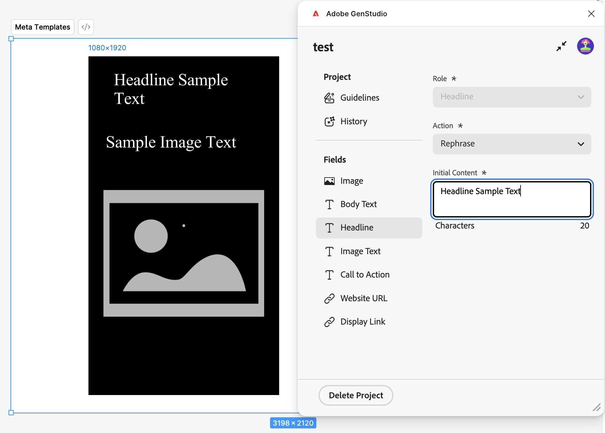
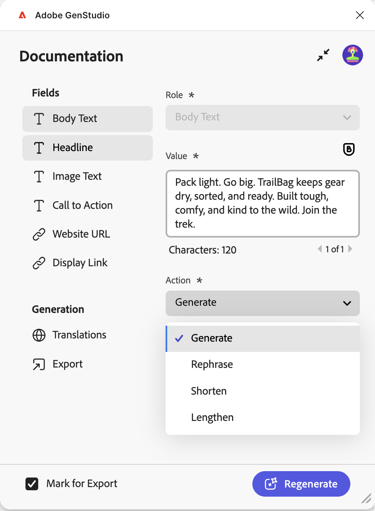

# Plug-in Figma per GenStudio for Performance Marketing

Il plug-in GenStudio for Performance Marketing Figma aggiunge un nuovo pannello all’applicazione Figma che consente di generare contenuti on-brand.
[Trovare e installare il plug-in dal marketplace della community Figma](https://www.figma.com/community/plugin/1604251370122180013/firefly-enterprise-and-genstudio).

Questa pagina descrive come configurare e utilizzare il plug-in.

Le funzioni di questo plug-in includono:

* Mappare gli elementi di testo Figma ai campi di GenStudio for Performance Marketing, ad esempio `headline`, `body`, `on_image_text` e altro ancora.
* Genera un nuovo Meta, LinkedIn o Annuncio di visualizzazione [!DNL Experiences] per marchio, persona, prodotto e prompt di testo.
* Creare [!DNL Experiences] direttamente nel documento Figma sostituendo il testo negli elementi Figma mappati con i valori generati da GenStudio for Performance Marketing.
* Riformula, accorcia, allunga o traduci il contenuto esistente in base a un prompt.
* Traduci [!DNL Experiences] generato in più lingue.
* Esporta [!DNL Experiences] generato in un&#39;origine locale come immagini appiattite.
* Esporta [!DNL Experiences] generato in GenStudio for Performance Marketing.
* Utilizza le opzioni del plug-in che si adattano agli elementi selezionati nell’area di lavoro di Figma.

>[!VIDEO](https://video.tv.adobe.com/v/3478809?learn=on)

## Creare un modello

Il plug-in richiede i primi due livelli del documento Figma per seguire questa convenzione:

* **Sezione** - Rappresenta il progetto padre, che può contenere più modelli.
* **Frame** - Rappresenta un modello in un progetto. Il modello può essere riempito con testo, immagini, componenti e altri elementi.

### Modelli Meta

Sono supportate le seguenti dimensioni di modello:

Per i post su Instagram o Facebook:

* Larghezza: 1080 px (fissa)
* Altezza: 1080 px o 1350 px

Per le storie su Instagram o Facebook:

* Larghezza: 1080 px (fissa)
* Altezza: 1920 px

Il plug-in determina il cromo dell’esperienza generata in base all’altezza del modello.

### Visualizza modelli

Non esiste alcun requisito di dimensione fissa. I modelli di visualizzazione supportano qualsiasi dimensione.

### Modelli LinkedIn

* Larghezza: 1200 px (fissa)
* Altezza: 1200 px, 628 px, 2292 px, 1800 px o 1500 px

### Mappatura ruolo campo

Il plug-in deve comprendere i diversi elementi del modello, come titolo, testo del corpo o immagine.

Per assegnare ruoli elemento:

1. Seleziona un elemento nel modello (testo, immagine e così via).
1. Utilizza il menu a discesa per assegnare un ruolo.

Il plug-in ricorda queste mappature da utilizzare per il contenuto generato. Un ruolo di campo\ può essere mappato a più elementi del modello.

{width="60%"}

### Eccezioni di mappatura campi

{{$include /help/_includes/field-mapping-exceptions.md}}

## Genera nuovo contenuto

Utilizza GenStudio for Performance Marketing AI per generare o apportare varianti agli elementi nei modelli Figma.

1. Se utilizzi GenStudio Plugin Playground o i modelli già preparati, seleziona il nodo di sezione che contiene i modelli di annuncio. Puoi eseguire questa operazione dal pannello **Livelli** o facendo clic direttamente sulla sezione nell&#39;area di lavoro.
   {width="50%" zoomable="yes"}
1. Nella finestra del plug-in, inserisci il nome di un progetto per le varianti, scegli una piattaforma per il contenuto e compila le altre informazioni richieste. Quindi fare clic sul pulsante **[!UICONTROL Termina installazione]**.
   {width="30%" zoomable="yes"}
1. Selezionare [!DNL Brand], [!DNL Persona] e [!DNL Product] da utilizzare per la generazione del contenuto.
1. Seleziona il numero di varianti da produrre (fino a otto).
1. Utilizza il pulsante in **[!UICONTROL Seleziona contenuto]** per sfogliare e scegliere le immagini dalle risorse. Le 40 risorse aggiunte più di recente vengono visualizzate per prime e puoi cercare altre risorse. Le immagini selezionate vengono automaticamente ridimensionate in base ai modelli.
1. Immettere un prompt di testo. Per ogni campo dell&#39;elenco **[!UICONTROL Campi]**, l&#39;opzione **[!UICONTROL Azione]** è impostata su **[!UICONTROL Genera]** per il nuovo contenuto.
1. Mappa tutti i ruoli del campo. Vedi [Mappatura ruolo campo](#field-role-mapping).
1. Fare clic sul pulsante **[!UICONTROL Genera]**.

## Traduci o genera varianti di ad copy da contenuto esistente

Utilizza GenStudio for Performance Marketing AI per generare varianti di ad copy o tradurre modelli Figma.

1. Seleziona il nodo della sezione che contiene i modelli di annuncio. Puoi eseguire questa operazione dal pannello **Livelli** o facendo clic direttamente sulla sezione nell&#39;area di lavoro.
   {width="50%" zoomable="yes"}
1. Nella finestra del plug-in, inserisci il nome di un progetto per le varianti e scegli una piattaforma per il contenuto.
1. In **[!UICONTROL Qual è l&#39;obiettivo?]**, selezionare **[!UICONTROL Genera varianti]** o **[!UICONTROL Traduci]**, quindi fare clic sul pulsante **[!UICONTROL Termina installazione]**.
   {width="30%" zoomable="yes"}
1. Selezionare [!DNL Brand], [!DNL Persona] e [!DNL Product] da utilizzare per la generazione del contenuto.
1. Seleziona il numero di varianti da produrre.
1. Utilizza il pulsante in **[!UICONTROL Seleziona contenuto]** per sfogliare e scegliere le immagini dalle risorse. Le 40 risorse aggiunte più di recente vengono visualizzate per prime e puoi cercare altre risorse. Le immagini selezionate vengono automaticamente ridimensionate in base ai modelli.
1. Immettere un prompt di testo. Per ogni campo dell&#39;elenco **[!UICONTROL Campi]**, l&#39;opzione **[!UICONTROL Azione]** è impostata su **[!UICONTROL Genera]** per il nuovo contenuto.
1. Mappa tutti i ruoli del campo. Vedi [Mappatura ruolo campo](#field-role-mapping).
1. Seleziona ciascun tipo di campo da generare varianti o tradurre nel pannello sul lato sinistro del plug-in e incolla il contenuto iniziale in ogni casella **[!UICONTROL Contenuto iniziale]**.
   {width="60%" zoomable="yes"}
1. Fare clic sul pulsante **[!UICONTROL Genera]**.

## Traduci contenuto dopo la generazione

1. Seleziona una generazione da tradurre.
   {width="20%" zoomable="yes"}
1. Scegli **[!UICONTROL Traduzione]**, quindi fai clic su **[!UICONTROL Traduci]**.
1. Seleziona la lingua o le lingue di destinazione.
1. Fai clic su **[!UICONTROL Seleziona]**.

I risultati della traduzione includono:

* Viene visualizzata una nuova pagina con il contenuto tradotto.
* Ogni traduzione mostra la lingua o le impostazioni internazionali di destinazione.
* Il contenuto originale rimane invariato nella pagina originale.

{width="60%" zoomable="yes"}

## Altre azioni sui campi di contenuto dopo la generazione

Durante la modifica del contenuto esistente in un campo, nel pannello del plug-in vengono visualizzate opzioni utili.

{width="30%" zoomable="yes"}

Le opzioni includono:

* Modificare **[!UICONTROL Valore]** per modificare direttamente il testo. La modifica di questo contenuto si applica automaticamente a tutte le varianti selezionate.
* L&#39;IA può eseguire molte opzioni **[!UICONTROL Azione]**, tra cui:

| Azione | Descrizione |
| --- | --- |
| **[!UICONTROL Genera]** | Genera una nuova variante del testo. |
| **[!UICONTROL Riformula]** | Genera una nuova variante del testo. |
| **[!UICONTROL Abbrevia]** | Genera una variante più breve del testo. |
| **[!UICONTROL Allunga]** | Genera una variante più lunga del testo. |

Dopo aver selezionato un&#39;opzione **[!UICONTROL Azione]**, rigenera il contenuto con il pulsante **[!UICONTROL Rigenera]**.

## Esportare esperienze

Le varianti possono essere esportate da Figma come GenStudio for Performance Marketing [!DNL Experiences].

1. Selezionare il contenuto da esportare nell&#39;area di lavoro di Figma eseguendo una delle operazioni seguenti:
   * Seleziona la sezione di generazione nell&#39;area di lavoro, quindi fai clic su **[!UICONTROL Contrassegna tutto per esportazione]** nel pannello dei plug-in.
     {width="20%" zoomable="yes"}
   * Seleziona una singola generazione nell&#39;area di lavoro, quindi fai clic su **[!UICONTROL Contrassegna per esportazione]** nel pannello del plug-in.
     {width="20%" zoomable="yes"}
1. Seleziona la voce Esporta dal menu della barra laterale.
   {width="60%" zoomable="yes"}
1. Seleziona una destinazione.
1. Fai clic su **[!UICONTROL Esporta]** per esportare il contenuto.

Nel pannello del plug-in viene creato un file ZIP oppure viene visualizzato un collegamento a **[!UICONTROL Apri in GenStudio]**. Utilizza il collegamento ZIP per scegliere dove salvare il file oppure seleziona **[!UICONTROL Apri in GenStudio]**.

## Conversione di frame Figma in Photoshop

>[!NOTE]
>
> Per eseguire questa attività, sono necessari sia il plug-in Figma che [GenStudio Photoshop](photoshop-plugin.md).

È possibile utilizzare il plug-in Figma per convertire un frame Figma, più frame o un intero documento in formato Photoshop ed esportarlo per l&#39;utilizzo con [GenStudio Photoshop](photoshop-plugin.md). Attualmente, durante la conversione sono supportate solo le proprietà principali come la visibilità, la dimensione del font e gli attributi di livello di base. Caratteristiche quali barrato, apice, pedice, opacità come percentuali, sfumature e proprietà avanzate simili non sono ancora supportate.

Il plug-in supporta i seguenti tipi di livelli Figma per la conversione:

* **Frame**
* **Gruppo**
* **Istanza**
* **Testo**
* **Vettore**
* **Immagine**

Quando si esegue la conversione in PSD, i livelli supportati vengono mappati in Photoshop nel modo seguente:

| Tipo di livello Figma | Converte in Photoshop | Note |
| --- | --- | --- |
| **Frame** | Gruppo di livelli | <ul><li>I fotogrammi di Figma vengono convertiti in gruppi di livelli Photoshop.</li><li>I fotogrammi nidificati diventano gruppi nidificati.</li><li>Le quote del fotogramma diventano i bordi della tavola da disegno o dei gruppi di PSD (a seconda della selezione).</li></ul> |
| **Gruppo** | Gruppo di livelli | <ul><li>I gruppi Figma vengono convertiti direttamente in gruppi di livelli Photoshop.</li><li>La gerarchia dei livelli e l&#39;ordine di impilamento vengono mantenuti.</li></ul> |
| **Istanza** | Gruppo di livelli | <ul><li>I componenti e le varianti vengono appiattiti nei gruppi di livelli standard di Photoshop. I metadati dei componenti e la logica delle varianti non vengono conservati.</li><li>Tutti i livelli figlio rimangono all&#39;interno del gruppo.</li></ul> |
| **Testo** | Livello testo | <ul><li>I livelli di testo Figma vengono convertiti in livelli di testo Photoshop modificabili.</li><li>La gerarchia del testo e il posizionamento vengono mantenuti.</li></ul> |
| **Vettore** | Livello forma | <ul><li>I livelli vettoriali di Figma vengono convertiti in livelli forma Photoshop.</li><li>I percorsi vengono conservati quando possibile.</li><li>I vettori complessi possono essere rasterizzati se vengono applicati effetti non supportati.</li></ul> |
| **Immagine** | Strato raster | <ul><li>I livelli immagine Figma vengono convertiti in livelli raster Photoshop.</li><li>Le proporzioni e il posizionamento delle immagini vengono mantenuti.</li></ul> |

### Come convertire i fotogrammi

Per convertire i fotogrammi:

1. Apri il plug-in Firefly Enterprise e GenStudio in Figma e fai clic sulla scheda **[!UICONTROL Esporta]** nell&#39;interfaccia utente del plug-in.
1. Nell&#39;area di lavoro selezionare il frame o i frame da esportare. Potete scegliere uno o più fotogrammi.
1. Esegui una delle operazioni seguenti:

   * Fai clic su **[!UICONTROL Esporta]** per esportare il file convertito nel percorso scelto, oppure
   * Fare clic su **[!UICONTROL Trasferisci a GenStudio Photoshop]** per memorizzare nella cache il file convertito per l&#39;utilizzo immediato in GenStudio Photoshop.
     {width="40%"}
1. Quando viene visualizzata la finestra di dialogo **[!UICONTROL Chiave file richiesta]**, il plug-in necessita di un URL di file Figma per completare la conversione. Aggiungi l&#39;URL per il documento:

   1. In Figma, fai clic su **[!UICONTROL Condividi]** nell&#39;angolo superiore destro dell&#39;area di lavoro.
   1. In **[!UICONTROL Condividi il file]**, fai clic su **[!UICONTROL Copia collegamento]**.
   1. Incolla il collegamento copiato nel campo **[!UICONTROL URL file Figma]** nella finestra di dialogo del plug-in.

1. Fai clic su **[!UICONTROL Invia]**. Il plug-in legge i fotogrammi selezionati in Figma e li converte in un documento JSON, un formato intermedio per i dati del file.
   {width="35%"}
1. In Photoshop, apri GenStudio Photoshop e fai clic sulla scheda **[!UICONTROL Importa]**.
1. Esegui una delle operazioni seguenti:

   * Fare clic su **[!UICONTROL Dal plug-in]** per scegliere un file convertito con **[!UICONTROL Trasferisci a GenStudio Photoshop]** dall&#39;elenco dei file memorizzati nella cache oppure
   * Fai clic su **[!UICONTROL Carica JSON]** per individuare e selezionare il file JSON da caricare.
     {width="40%"}
1. GenStudio Photoshop converte le informazioni dal documento JSON in un documento Photoshop aperto.
1. Fai clic su **[!UICONTROL Fine]**. Il nuovo file si apre in Photoshop ed è pronto per l’uso. Oppure fare clic su **[!UICONTROL Salva con nome...]** per scegliere un percorso in cui salvare il file.
   {width="40%"}

## Cronologia della generazione

Il plug-in mantiene una cronologia delle modifiche per ciascun campo. Nella pagina del modello, scegli **[!UICONTROL Cronologia generazione]** nella barra laterale del plug-in.

{width="80%" zoomable="yes"}

## Risoluzione dei problemi

Prendi in considerazione queste best practice e suggerimenti se testo o immagini non vengono sostituiti nelle varianti generate.

### Campi mappati

Se il testo o le immagini non vengono sostituiti, verifica che i campi siano stati mappati sui ruoli dei campi di GenStudio nell’interfaccia utente del plug-in. Vedi [Mappatura ruolo campo](#field-role-mapping).

### Conferma che i font siano disponibili

Affinché la sostituzione venga eseguita durante la generazione, è necessario che nel computer sia disponibile un tipo di carattere per il campo di testo. Verificare che tutti i tipi di carattere utilizzati nel file siano disponibili nel computer, soprattutto se il file è stato creato nel computer di un altro utente.

### Considerare il supporto per il ruolo del campo

Alcuni canali supportano la sostituzione solo in campi specifici. Tieni presente le eccezioni per il mapping di ruoli del campo [&#128279;](#field-role-mapping).
