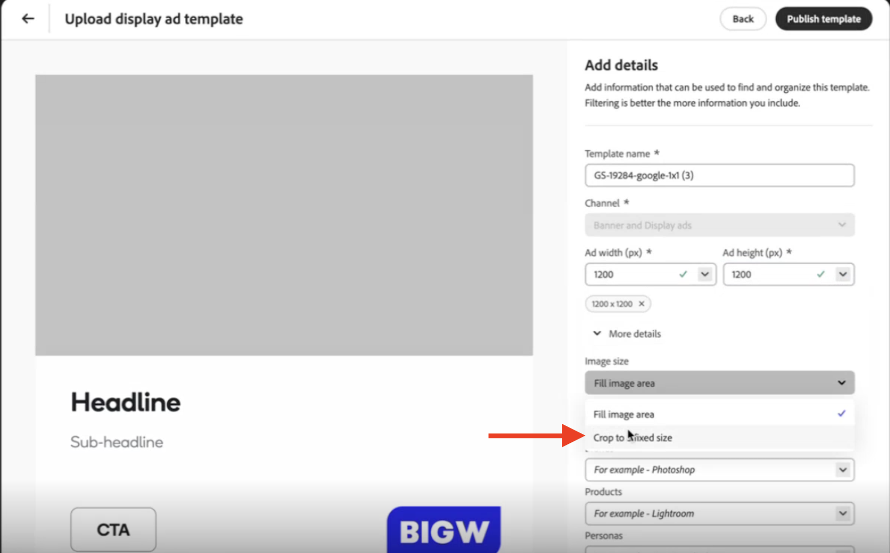

# Best practice per l’utilizzo dei modelli

I modelli riducono in modo significativo il tempo e l’impegno necessari per generare nuovi contenuti, fornendo un punto di partenza che include layout preconfigurati ed elementi di progettazione.

Quando utilizzi i modelli con GenStudio for Performance Marketing, attieniti alle seguenti raccomandazioni:

1. Informazioni su [elementi modello](#know-about-template-elements)
1. Configura le [linee guida per i canali](#configure-channel-guidelines) per una personalizzazione efficace dei contenuti
1. Progettazione con [standard di accessibilità](accessibility-for-templates.md) per un&#39;esperienza ottimale
1. Segui [linee guida per modelli specifici per canale](#follow-channel-specific-template-guidelines)
1. Quando utilizzi [Modelli Express](/help/user-guide/templates/express-templates.md), considera i suggerimenti specifici in [Best practice per modelli Express to GenStudio](#express-to-genstudio-template-best-practices).
&#x200B;>>
Scopri le nozioni di base sugli elementi e sulle procedure dei modelli in [Operazioni con i modelli](use-templates.md). Approfondisci [la personalizzazione di un modello](customize-template.md) per istruzioni specifiche da utilizzare nella prossima campagna.

## Utilizzare gli elementi di modello corretti

Ogni tipo di modello utilizza elementi diversi per creare una struttura per la creazione di contenuti specifici per il canale. [Acquisisci familiarità con le parti di un modello](use-templates.md#template-elements) e includi gli elementi migliori per il contenuto e il tipo di modello.

Quando personalizzi il modello, utilizza i nomi dei campi al posto di questi elementi dove è necessario GenStudio for Performance Marketing per generare il contenuto.

Vedi [Elementi modello](use-templates.md#template-elements).

## Utilizzo del testo segnaposto nei modelli

Il testo segnaposto può essere utile per definire la sintassi o la struttura del contenuto da compilare successivamente in un modello da parte di un utente. Ad esempio, {first_name}.{last_name}@email.etc. per definire un indirizzo e-mail. Tuttavia, alcuni delimitatori comuni sono già riservati ad altri significati in GenStudio for Performance Marketing:

❌ `< >` - In uso per i tag HTML.
❌ `{{ }}` - In uso per le espressioni Handlebar.

Utilizzare parentesi uniche (rette o ricce) per indicare il testo segnaposto per evitare confusione con i tag esistenti.

✅ `{first_name}` - Segnaposto per nome.

## Configurare le linee guida per i canali

Definire linee guida chiare per il canale è essenziale per garantire che i contenuti generati siano in linea con i requisiti e gli obiettivi del tuo marchio. Le linee guida per il canale consentono di specificare regole per elementi quali il tono, la lunghezza e lo stile utilizzati nel modello. Ad esempio, puoi impostare un numero massimo di caratteri per il corpo o richiedere uno stile call-to-action specifico. Impostando queste linee guida in anticipo, riduci la necessità di scrivere istruzioni dettagliate in ogni prompt di IA, semplificando il processo di generazione dei contenuti e garantendo coerenza nelle e-mail.

Rivedi e definisci le [linee guida per il canale](/help/user-guide/guidelines/brands.md#channel-guidelines) del tuo marchio per tutti i campi chiave nel modello. Se non definisci le linee guida, vengono applicate le [linee guida predefinite per il canale](/help/user-guide/guidelines/brands.md#default-channel-guidelines), che potrebbero non riflettere completamente i requisiti del brand.

Scopri in che modo [Marchi, Prodotti e Linee guida per Personas](/help/user-guide/guidelines/overview.md) influenzano i contenuti generati e come adattarli agli obiettivi di marketing.

## Caricamento immagini per modelli

Le immagini utilizzate nei modelli devono provenire dall’archivio dei contenuti e devono essere caricate correttamente per garantire una visualizzazione accurata.

Quando un modello presenta un&#39;immagine da spigolo a spigolo (full bleed), l&#39;immagine selezionata viene automaticamente ridimensionata per adattarsi alle dimensioni complete del modello. Tuttavia, se l’immagine non corrisponde alle proporzioni del modello, viene ritagliata per adattarla alle dimensioni del modello e potrebbe non essere visualizzata come previsto.

Non è disponibile la funzionalità di adattamento automatico per le immagini incluse nei modelli.

Per risolvere il ritaglio di immagini, gli utenti devono definire le proporzioni dell’immagine da utilizzare nel modello quando viene caricata nell’archivio dei contenuti. Durante il caricamento di un modello approvato:

1. [Procedi attraverso il processo di caricamento del modello](/help/user-guide/templates/use-templates.md#add-a-template) fino a raggiungere la pagina **[!UICONTROL Aggiungi dettagli]**.

2. Definisci le proporzioni dell&#39;immagine da utilizzare nel modello in **[!UICONTROL Larghezza annuncio (px)]** e **[!UICONTROL Altezza annuncio (px)]**. In questo modo viene definita la finestra immagine per la sezione del modello che visualizza l&#39;immagine.

3. Nella sezione **[!UICONTROL Ulteriori dettagli]**, seleziona il menu a discesa **[!UICONTROL Dimensioni immagine]** e scegli _Ritaglia a dimensioni fisse_.
   {width="80%"}

Per determinare le dimensioni e le proporzioni di un&#39;immagine nel browser:

1. Ispezionare l&#39;immagine.
   - Su Windows/Linux:
      - Premere F12.
   - Su macOS:
      - Premere Command + Option + I.

1. Passa il puntatore sull&#39;immagine.

1. Osserva le proporzioni. Utilizzate questa opzione per definire le proporzioni dell&#39;immagine nel modello.

Se questi dettagli non vengono applicati durante il caricamento, si presume che l’immagine corrisponda all’intera proporzione del modello e che le immagini che non corrispondono esattamente a tale proporzione verranno ritagliate.

{width="60%"}

**❌immagine ritagliata in un modello di annuncio visualizzato**

{width="60%"}

**✅immagine completamente visualizzata**

## Segui le linee guida dei modelli specifiche per il canale

Quando crei i modelli, accertati che soddisfino i requisiti specifici del canale previsto. Crea modelli che soddisfino i requisiti di layout e di visualizzazione per ogni canale. Esistono linee guida generali applicabili a qualsiasi modello, ad esempio:

- Utilizzare HTML e CSS in linea puliti e reattivi
- Utilizzare i caratteri Adobe o Google
- **non** utilizza JavaScript

{{note-css-effects}}

Per prestazioni ottimali, consulta ulteriori suggerimenti e vincoli durante l’utilizzo di ciascun tipo di modello:

- [E-mail](/help/user-guide/templates/email-template.md)
- [Visualizzazione e banner pubblicitari](/help/user-guide/templates/display-template.md)
- [LinkedIn](/help/user-guide/templates/linkedin-template.md)
- [Meta ads](/help/user-guide/templates/meta-template.md)

## Best practice relative ai modelli da Express a GenStudio

I suggerimenti seguenti consentono di ottenere risultati affidabili quando si convertono le progettazioni da [!DNL Adobe Express] in modelli per [!DNL GenStudio for Performance Marketing].

### Utilizzare modelli con più varianti

In [!DNL Adobe Express] le pagine possono rappresentare più varianti di dimensione o proporzioni in un file modello.
Quando selezioni il modello in [!DNL GenStudio for Performance Marketing], tutte le varianti vengono visualizzate nell&#39;area di lavoro.

Questo comportamento migliora i modelli di HTML, che supportano una sola variante per file.

### Blocco dei campi per controllare ciò che gli addetti al marketing possono modificare

Utilizza il blocco per comunicare l’intento. Ad esempio, blocca una liberatoria legale in modo che non venga mai generata dall’intelligenza artificiale, ma lascia un titolo flessibile per la generazione.

Fare clic con il pulsante destro del mouse su qualsiasi elemento in [!DNL Adobe Express] per impostare il comportamento di blocco:

- **[!UICONTROL Blocco completo]**: l&#39;elemento è statico e IA non genera contenuto per l&#39;elemento.
- **[!UICONTROL Blocca, consenti sostituzione immagine]**: blocca dimensioni e posizione, ma consente agli utenti di scambiare l&#39;immagine. Questa opzione funziona bene per i logo.
- **[!UICONTROL Blocca, consenti sostituzione testo]** - Blocca dimensioni e posizione ma consente agli utenti di modificare il testo. L’intelligenza artificiale non genera automaticamente il contenuto per essa.
- **Pienamente flessibile** (sbloccato): gli utenti possono spostare e ridimensionare l&#39;elemento e AI lo tratta come contenuto da generare.

### Livelli di nome per una migliore mappatura AI

Quando si converte una progettazione in un modello, l’intelligenza artificiale analizza la progettazione e mappa i campi come titolo, CTA e copia del corpo. L’intelligenza artificiale mappa modelli semplici con maggiore precisione rispetto ai layout altamente complessi.

**Best practice:** Nella copia segnaposto, includi il tipo di campo previsto (ad esempio `headline`, `sub-headline` o `CTA`) per consentire la corretta mappatura dei campi AI. Questo approccio può ridurre gli errori di mappatura.

### Converti in modello

1. In [!DNL Adobe Express], fare clic su **[!UICONTROL Condividi]** > **[!UICONTROL Converti in modello]**.
1. Solo la scheda **[!UICONTROL Informazioni]** e la scheda **[!UICONTROL Blocchi]** vengono riportate a [!DNL GenStudio for Performance Marketing].
1. Al momento della conversione, scegli come funziona lo sblocco:
   - **[!UICONTROL Sblocca utenti]**
   - **[!UICONTROL Impedisci lo sblocco]**
   - **[!UICONTROL Imposta una passphrase]**: motivo intermedio che scoraggia le modifiche occasionali senza bloccare definitivamente l&#39;accesso.

### Mantieni una copia del file di progettazione originale

La conversione crea un file modello [!DNL Adobe Express] separato, tuttavia il file di progettazione originale rimane modificabile.

**Suggerimento:** conserva l&#39;originale in modo da poter rivedere la progettazione, creare varianti e generare nuovi modelli in un secondo momento.

### Condividi per una maggiore visibilità

Dopo la conversione, il modello è visibile solo a te per impostazione predefinita. Puoi condividerlo con singoli utenti o con l’intera organizzazione.

**Requisito:** [!DNL Adobe Express] e [!DNL GenStudio for Performance Marketing] devono utilizzare la stessa organizzazione IMS per i modelli da sincronizzare. I modelli vengono in genere visualizzati in [!DNL GenStudio for Performance Marketing] quasi immediatamente dopo la conversione.

### Mappatura campi IA di controllo

Dopo aver selezionato un modello, AI esegue il mapping dei campi una volta per modello, assegnando etichette come **[!UICONTROL file multimediali primari]**, **[!UICONTROL generati]** o **[!UICONTROL bloccati]**. È possibile regolare le mappature manualmente quando AI assegna i campi in modo errato.

Utilizza l&#39;interruttore **[!UICONTROL Abilita generazione]** per campo da attivare o disattivare prima della generazione. È possibile regolare le mappature manualmente quando AI assegna i campi in modo errato. Le correzioni permanenti alle mappature dei modelli sono pianificate per una versione futura.

### Progettazione in [!DNL Adobe Express], assemblaggio in [!DNL GenStudio for Performance Marketing]

Prendi in considerazione questi flussi di lavoro di progettazione per utilizzare al meglio ogni servizio:

- Completare il lavoro di progettazione, ad esempio colori, layout ed elementi grafici in [!DNL Adobe Express].
- Utilizza [!DNL GenStudio for Performance Marketing] per assemblare e generare contenuti da tali modelli.
- Utilizza [!DNL Adobe Express] marchi (colori, loghi, font e grafica) per la governance della progettazione.
- Utilizza [!DNL GenStudio for Performance Marketing] marchi per le modifiche del colore del font dopo la generazione.

### Limitazioni delle e-mail

L&#39;indirizzo e-mail **non** è supportato nell&#39;area di lavoro di Horizon Canvas per il flusso di lavoro del modello [!DNL Adobe Express]. L’e-mail continua a utilizzare il processo di modelli tradizionale di HTML.

### Sfruttare i tipi di carattere personalizzati

I team chiedono spesso come funzionano i font personalizzati con i modelli [!DNL Adobe Express]. Gli amministratori potrebbero dover accettare l&#39;offerta di qualificazione per i font personalizzati in Admin Console prima che tali font siano disponibili; vedi [Utilizzo di [!DNL Adobe Express] modelli](express-templates.md).
