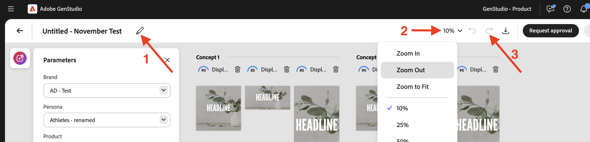
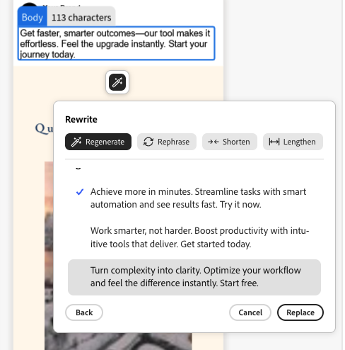

# Utilizzo di [!DNL Adobe Express] modelli

[!DNL GenStudio for Performance Marketing] può utilizzare i modelli creati e progettati in [!DNL Adobe Express]. Porta risorse con marchio da [!DNL Adobe Express] e utilizza questi potenti strumenti per integrarle in campagne di marketing coinvolgenti e [!DNL Experiences].

Questa guida descrive i requisiti e le funzionalità con i modelli di [!DNL Adobe Express].

## Informazioni sui modelli in [!DNL Adobe Express]

In [!DNL Adobe Express], è possibile creare [nuovi documenti utilizzando modelli iniziali esistenti](https://helpx.adobe.com/it/express/web/documents-and-presentations/text-flow-template.html?x-product=Helpx%2F1.0.0&x-product-location=Search%3AForums%3Alink%2F3.7.5) forniti nell&#39;applicazione o [modelli personalizzati che possono includere utili limitazioni del marchio](https://helpx.adobe.com/express/web/brands-libraries-projects/create-manage-brands/edit-shared-template.html) come:

- [Elementi bloccati](https://helpx.adobe.com/it/express/web/invite-collaborate/object-locking.html) che non possono essere modificati
- Blocca le restrizioni che controllano il modo in cui gli utenti possono sbloccare gli elementi quando necessario

Le impostazioni di blocco impostate sul modello in [!DNL Adobe Express] verranno applicate anche in [!DNL GenStudio for Performance Marketing]. Utilizza [le [!DNL Adobe Express] istruzioni per creare un modello personalizzato con restrizioni del brand](https://helpx.adobe.com/it/express/web/brands-libraries-projects/create-manage-brands/template-control.html).

Per utilizzare font personalizzati in un modello Express, gli amministratori devono prima accettare l’offerta di qualificazione dei font personalizzati nell’Admin Console, inclusa come parte del diritto alla licenza Express.

## Trova modelli rapidi

Gli utenti visualizzeranno nuove schede in Crea per selezionare Modelli rapidi. È possibile accedere ai modelli rapidi in GenStudio for Performance Marketing quando tali modelli sono:

- Creato dall’utente
- Condiviso con l&#39;utente
- Condiviso per l’organizzazione dell’utente, utilizzando la stessa organizzazione IMS in entrambe le app

Dopo aver selezionato un tipo di modello, trova tutti i modelli Express disponibili nel flusso di lavoro Crea. I modelli rapidi sono disponibili solo per i tipi seguenti:

- [!DNL Meta]
- [!DNL Display]
- [!DNL LinkedIn]
- [!DNL TikTok]

Nella barra superiore di **[!UICONTROL Seleziona modello]**, individua **Modelli Express**.

{width=70%}

Quando selezioni un modello [!DNL Express] e fai clic su **[!UICONTROL Usa]**, i parametri di pre-bozza e il prompt verranno visualizzati in un pannello a comparsa a sinistra. Fai clic sul pulsante **[!UICONTROL Genera]** per creare nuovo contenuto con il modello selezionato.

{width=90%}

>[!IMPORTANT]
>
>Durante la generazione del contenuto, ai livelli modello rapido verranno automaticamente assegnati i tag con i ruoli di campo per [!DNL GenStudio for Performance Marketing]. Gli elementi di un modello possono anche essere [taggati manualmente](#manual-tagging-of-templates).

## Informazioni sulle varianti e [!DNL Experiences] con [!DNL Adobe Express] modelli

I modelli di [!DNL Express] offrono molte delle stesse funzionalità che ti saranno familiari quando [gestisci altre varianti](https://experienceleague.adobe.com/it/docs/genstudio-for-performance-marketing/user-guide/create/manage-variants#manually-edit-text). Tuttavia, sono disponibili alcune potenti aggiunte per semplificare qualsiasi flusso di lavoro per il contenuto da [!DNL Express]. In questa sezione vengono descritte le funzionalità esclusive dell&#39;implementazione di [!DNL Adobe Express].

### Genera automaticamente più dimensioni

Quando sono state create [più pagine per una risorsa in [!DNL Express]](https://helpx.adobe.com/it/express/web/arrange-layers-and-pages/add-pages.html), queste pagine vengono riportate in qualsiasi modello creato da tale risorsa. Ciascuna pagina Express verrà generata in dimensioni diverse del contenuto creativo in [!DNL GenStudio for Performance Marketing].

Se per una risorsa in [!DNL Express] esistono più contenuti di dimensione, è possibile generare varianti per tutte le dimensioni in un&#39;unica generazione.

### Riposizionamento e ridimensionamento degli elementi

Gli elementi di un modello possono essere ridimensionati o spostati per adattarsi semplicemente facendo clic su di essi e trascinandoli nel riquadro Area di lavoro.

Ridimensionare facendo clic e trascinando un elemento da un punto angolo.

### Funzioni di intestazione del riquadro dell’area di lavoro

Utilizzare i pulsanti nell&#39;intestazione del riquadro Area di lavoro per:

1. Ridenominate la bozza
1. Cambia il livello di zoom per la visualizzazione
1. Annulla e ripristina modifiche

### Assegna feedback al gruppo di esperienze

Assegna un feedback a ciascun gruppo di varianti generate. Queste etichette di feedback aiutano l’intelligenza artificiale a capire quali varianti dovrebbero essere considerate nelle generazioni successive.

Fai clic su &quot;...&quot; per aprire il menu a discesa di:

- Buon risultato
- Output insufficiente
- Elimina: elimina il gruppo di varianti.

### Eliminare una variante

Una singola dimensione di variante generata in un gruppo di esperienze può essere eliminata utilizzando l’icona del cestino.

{width=300}

### Barra spaziatrice-panning

Tenere premuto **[!UICONTROL Spazio]** per abilitare una funzionalità di trascinamento e clic per &quot;trascinare&quot; il riquadro di visualizzazione Area di lavoro.

È inoltre possibile spostare il riquadro di visualizzazione con uno scorrimento a due dita.

### Modifica manuale del testo

Puoi modificare i campi di testo nelle varianti generate. Perfeziona il testo per il pubblico sperimentando diverse frasi e parole e applicando la formattazione. Ad esempio, puoi applicare il grassetto e allineare a destra il testo di una variante per adattarlo al layout di un’immagine.

{width=60%}

La formattazione del testo disponibile include:

- Grassetto, corsivo e sottolineato
- Colore del testo (nero, bianco o colori del marchio)
- Allineamento a sinistra, al centro e a destra
- Elenchi puntati e ordinati
- Dimensione testo
- Apice o pedice

**Per modificare manualmente il testo nelle varianti generate**:

1. Dopo aver generato un set di varianti, fai doppio clic sul testo modificabile in una variante.
1. Immettere il nuovo testo.
1. Per formattare il testo, fare clic su o digitare nell&#39;elemento casella di testo. Le opzioni di formattazione verranno visualizzate in una barra a comparsa. Tenendo premuto Maiusc la barra viene nascosta per visualizzare il testo.
1. Fai clic lontano dal campo di testo per salvare le modifiche.

### Visualizza livelli

Potete selezionare rapidamente un singolo livello di una variante e apportare modifiche, ad esempio rigenerare sezioni o ritagliare immagini. Quando selezionate un singolo livello, vengono evidenziati i campi o le immagini modificabili all&#39;interno del livello.

**Per visualizzare i livelli di una variante**:

1. Dopo aver generato un set di varianti, fai clic su un campo o un’immagine modificabile all’interno di una variante. I livelli verranno visualizzati in una riga di sezioni in alto a destra.
   {width=50%}
1. Fate clic su una sezione di livello per selezionarla. Il livello selezionato viene evidenziato per la variante.
1. Procedi con le modifiche necessarie al livello selezionato.

### Riscrivi sezioni

[!DNL GenStudio for Performance Marketing] dispone della funzionalità incorporata per rigenerare sezioni di varianti generate. È possibile riformulare, ridurre o allungare il testo oppure aggiungere nuovi prompt per generare nuovo contenuto.

Ad esempio, puoi generare nuovamente la sezione titolo di una variante di annuncio Meta per vedere come si presenta con una risorsa in background specifica. È possibile **[!UICONTROL Riformulare]**, **[!UICONTROL Abbreviare]** o **[!UICONTROL Allungare]** il contenuto del testo di una sezione oppure **[!UICONTROL Rigenerare]** il testo utilizzando un prompt di guida.

{width=50%}

**Per riscrivere singole sezioni di varianti**:

1. Dopo aver generato un set di varianti, fai clic su qualsiasi testo modificabile in una variante. Viene visualizzata l&#39;icona della bacchetta.
1. Fare clic sull&#39;icona bacchetta per aprire il riquadro Riscrittura.
1. Per modificare il testo esistente, selezionare **[!UICONTROL Riformula]**, **[!UICONTROL Riduci]** o **[!UICONTROL Allunga]**.
1. Per generare nuove opzioni di sillabazione, selezionare **[!UICONTROL Rigenera]** e immettere un nuovo prompt.
   1. Fai clic su **[!UICONTROL Genera]**.
1. I risultati vengono visualizzati come opzioni nel riquadro. Selezionare l&#39;opzione desiderata e fare clic su **[!UICONTROL Sostituisci]**. La variante viene aggiornata con il testo rivisto.

{width=50%}

### Ritagliare le risorse

Con lo strumento Ritaglia è possibile ritagliare e riposizionare manualmente le risorse immagine in singole varianti generate.

**Per ritagliare e riposizionare le immagini nelle varianti**:

1. Dopo aver generato un set di varianti, fai doppio clic su una risorsa per attivare il rettangolo di selezione.
1. Regolate il riquadro di delimitazione dell&#39;immagine trascinandolo da qualsiasi bordo o angolo oppure trascinate l&#39;intera immagine nella posizione desiderata.

### Scambia risorse

Puoi aggiungere o sostituire immagini, loghi approvati o risorse video nelle varianti generate direttamente dall’interfaccia utente di Canvas.

**Per aggiungere o sostituire risorse in una variante**:

1. Dopo aver generato un set di varianti, fai clic su una risorsa (o sull’area della risorsa immagine, se attualmente non esiste un’immagine). Viene visualizzata un&#39;icona di sostituzione.
1. Fai clic sull’icona di scambio per aprire la pagina Seleziona risorse.
1. Utilizza la funzione Filtri e ricerca nella vista Contenuto di GenStudio Assets per restringere ulteriormente i risultati della ricerca.
1. È inoltre possibile utilizzare le immagini disponibili negli archivi Assets Content Hub di [!DNL Adobe Experience Manager] (AEM) connessi selezionando tale archivio dal menu **[!UICONTROL Posizione]**.
1. Fare clic per selezionare un&#39;immagine e fare clic su **[!UICONTROL Usa]**. L’immagine viene aggiunta o scambiata nella variante applicabile.

### Assegnazione manuale di tag ai modelli

Gli elementi nei modelli vengono automaticamente taggati durante la [generazione del modello](#find-express-templates) nel flusso di lavoro di creazione. Ma questi elementi possono anche essere taggati manualmente.

**Per assegnare manualmente un tag a un elemento modello**:

1. Seleziona l’elemento sul modello.
1. Utilizza il menu a discesa per selezionare il tag per tale elemento.
   {width=80%}

Le opzioni di assegnazione tag variano a seconda del tipo di elemento.

### Restrizioni blocco modello

I modelli possono includere [elementi bloccati](https://helpx.adobe.com/it/express/web/invite-collaborate/object-locking.html) che vengono trasferiti da [!DNL Express] e controllano come alcune funzionalità possono essere modificate. Queste impostazioni vengono rispettate dal modello e possono essere modificate anche nel modello:

1. Seleziona un elemento bloccato sul modello.
1. Fai clic sull’icona del lucchetto in alto a sinistra per l’elemento selezionato.
1. Seleziona l’opzione corretta per sbloccare l’elemento.
   {width=60%}

### Assemblaggio video

I modelli che includono video possono sfruttare le funzioni di Video Assembly.

**Per utilizzare l&#39;assembly video**:

1. Selezionare un&#39;esperienza e fare clic sul pulsante **[!UICONTROL Modifica]** per attivare la modalità di attivazione e utilizzare le funzionalità di assemblaggio video. Viene visualizzata solo la singola variante e la linea della scena viene visualizzata lungo la parte inferiore.
   {width=70%}
1. Regola la tua esperienza video. Le opzioni di assemblaggio video includono:
   - Riproduci video
   - Disattiva e riattiva audio
   - Aggiungi nuovi contenuti video con il pulsante &quot;+&quot;
   - Impostazioni durata video
   - Modificare l’ordine dei contenuti video con il trascinamento
1. Dopo aver modificato il video, usa il pulsante **[!UICONTROL Esci]** in alto per salvare le modifiche e tornare all&#39;area di lavoro infinita.

### Modificare le immagini con Espansione generativa

I livelli immagine possono espandersi con l’intelligenza artificiale per adattarsi a qualsiasi dimensione desiderata in un’esperienza.

**Per espandere un&#39;immagine con Espansione generativa**:

1. Seleziona un livello immagine sbloccato e fai clic sul pulsante **[!UICONTROL Espandi]** nella parte inferiore della cornice immagine.
   {width=70%}
1. Portare il frame alle dimensioni desiderate in cui l&#39;immagine verrà espansa. Viene visualizzata la finestra Espandi opzioni. Nelle opzioni Espandi, puoi facilitare l’espansione:
   - Inserimento di un prompt
   - Scelta dell&#39;adattamento al frame
   - Reimpostare le dimensioni
     {width=50%}
1. Fai clic su **[!UICONTROL Espandi]** per creare la generazione. Le varianti tra cui scegliere verranno visualizzate nella parte inferiore della cornice.
1. Seleziona la variante migliore e fai clic su **[!UICONTROL Mantieni]**.
   {width=50%}

{width=60%}

### Convalida del brand

Utilizza il pannello _Verifica contenuto_ per mantenere l&#39;identità del brand, gli standard di accessibilità ADA, le linee guida della piattaforma e l&#39;allineamento delle varianti.

Consulta [Convalida marchio](/help/user-guide/guidelines/brand-validation.md).

## Rivedi e approva

Dopo aver modificato e regolato le varianti, approva e pubblica i contenuti con [il flusso di lavoro Recensioni e approvazione](https://experienceleague.adobe.com/it/docs/genstudio-for-performance-marketing/user-guide/approve/overview).

